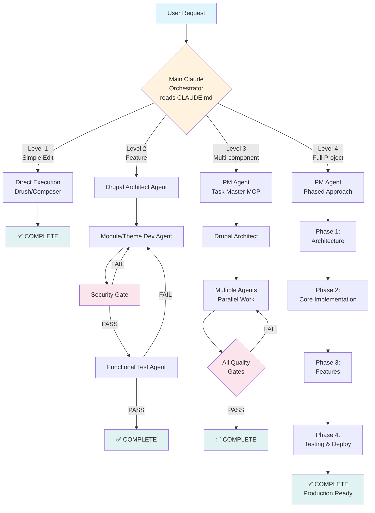
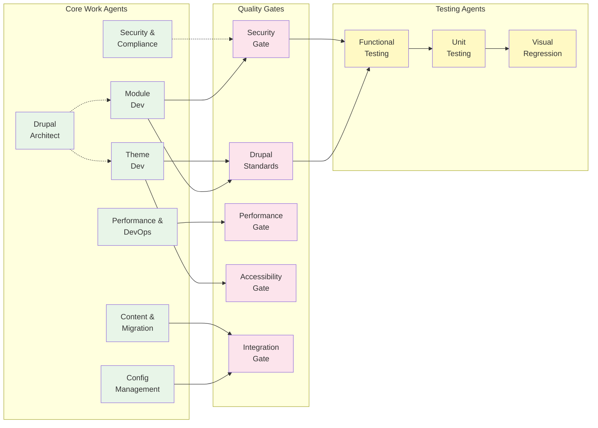
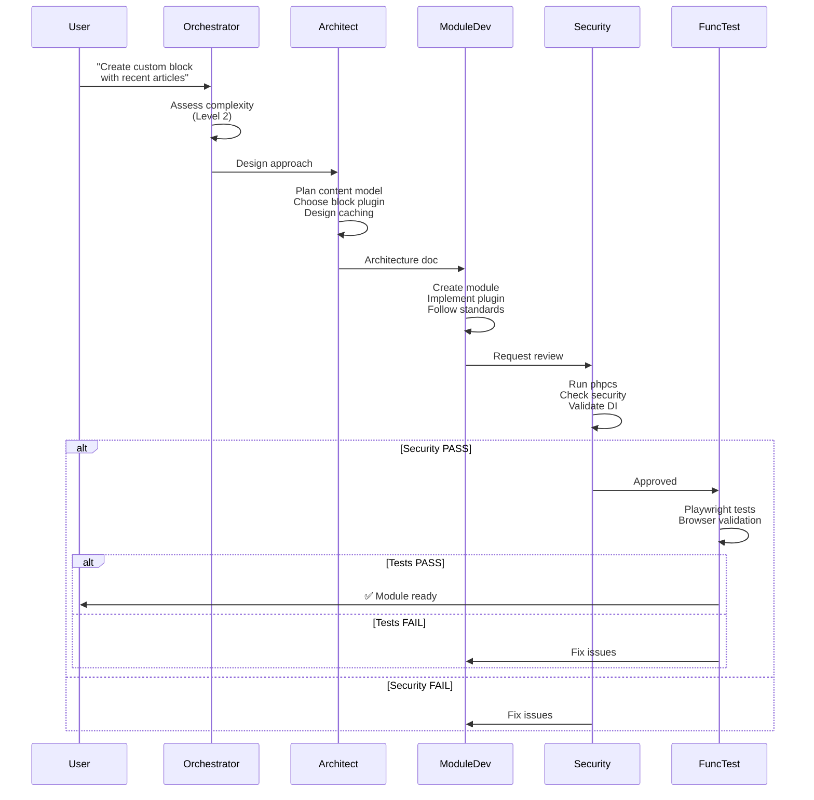
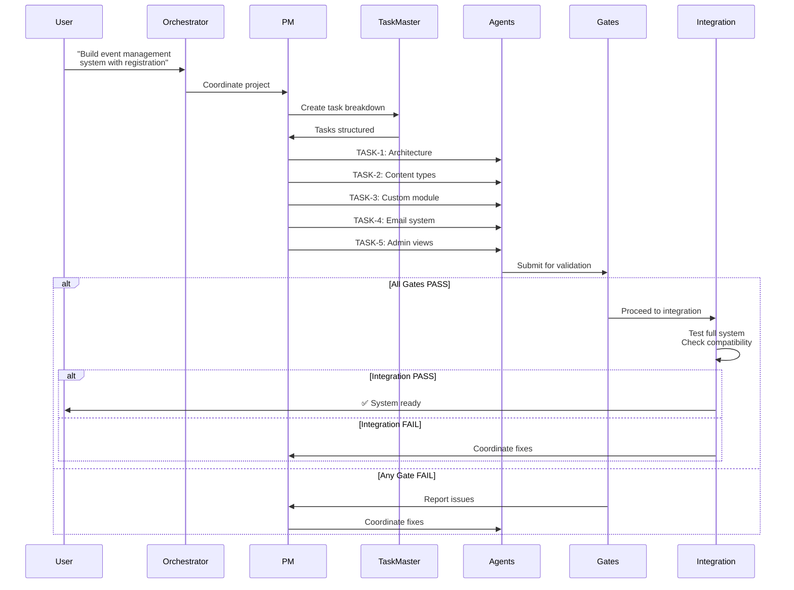
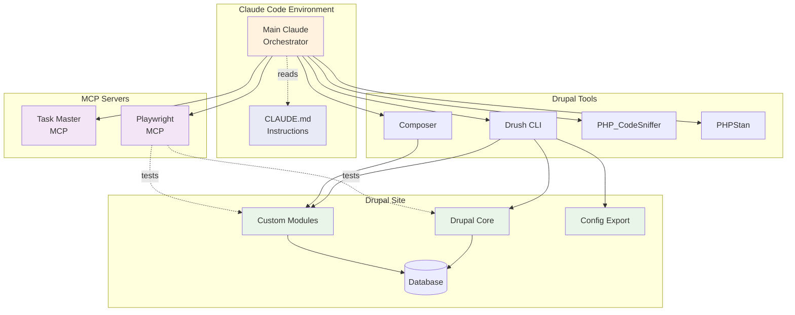
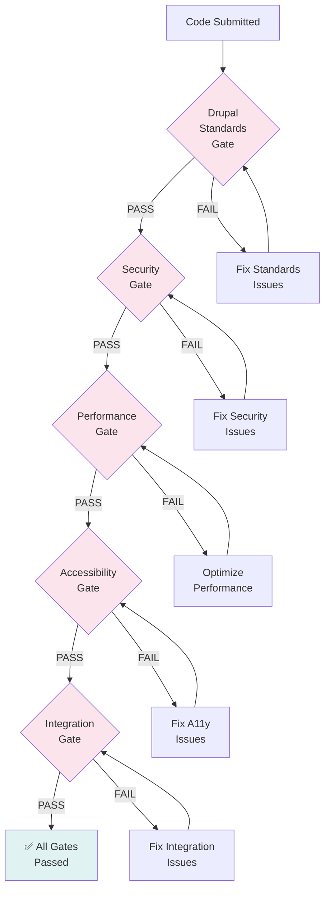
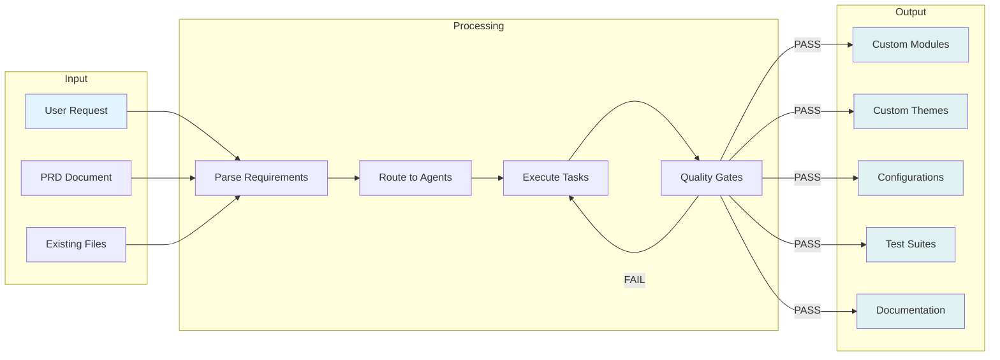
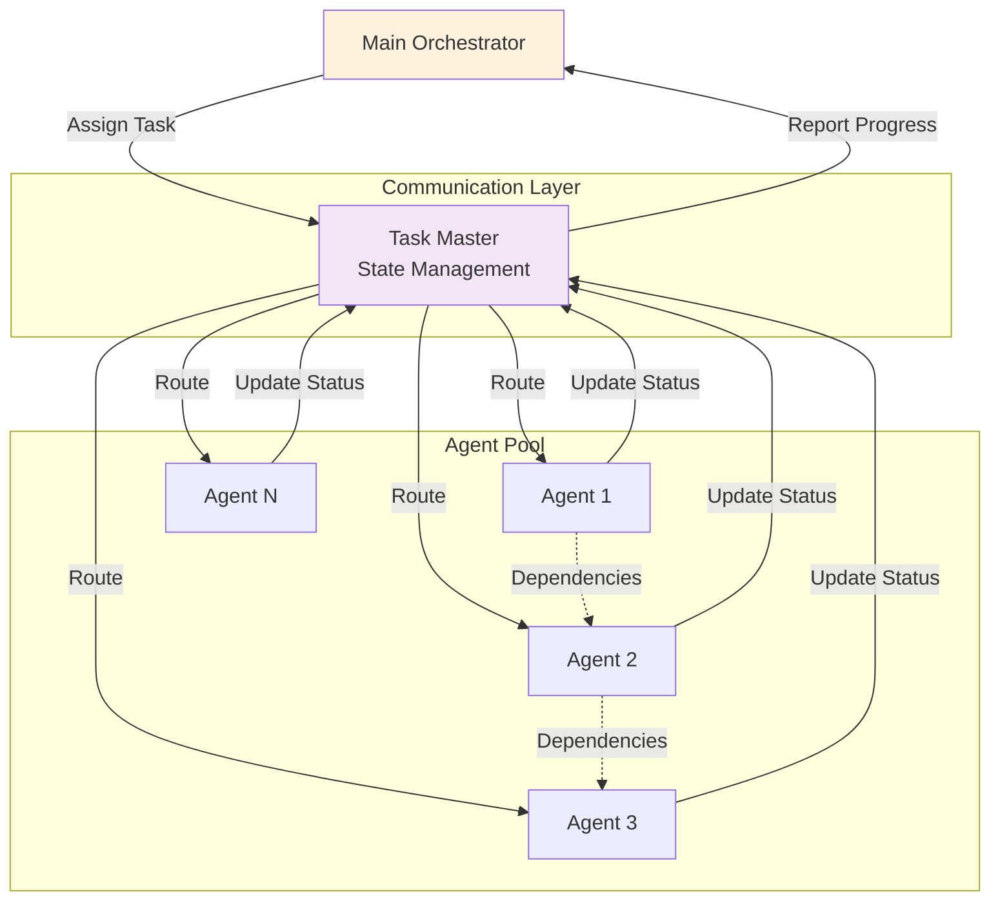
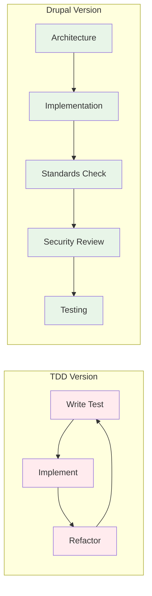

# Drupal Sub-Agent Collective - Architecture Diagrams

## System Architecture

## Agent Ecosystem

## Level 2 Workflow (Feature Development)

## Level 3 Workflow (Multi-Component System)

## Tool Integration Flow

## Quality Gate Process

## Data Flow

## Agent Communication Pattern

## Comparison: TDD vs Drupal Version

## Deployment Pipeline

```mermaid
graph LR
    Dev[Development<br/>Environment]
    Test[Testing<br/>Environment]
    Stage[Staging<br/>Environment]
    Prod[Production<br/>Environment]
    
    Dev -->|drush cex| ConfigExport[Config Export]
    ConfigExport -->|Git Commit| VCS[Version Control]
    VCS -->|Deploy| Test
    
    Test -->|drush cim| TestImport[Config Import]
    TestImport -->|Validate| TestValidate{Tests Pass?}
    
    TestValidate -->|Yes| Stage
    TestValidate -->|No| Dev
    
    Stage -->|drush cim| StageImport[Config Import]
    StageImport -->|Validate| StageValidate{QA Pass?}
    
    StageValidate -->|Yes| Prod
    StageValidate -->|No| Dev
    
    Prod -->|drush cim| ProdImport[Config Import]
    ProdImport --> Live[✅ Live Site]
    
    style Dev fill:#e3f2fd
    style Test fill:#fff9c4
    style Stage fill:#fff3e0
    style Prod fill:#e8f5e8
    style Live fill:#e0f2f1
```

---

## How to Use These Diagrams

1. **System Architecture**: Understand overall flow based on complexity levels
2. **Agent Ecosystem**: See how agents and gates interconnect
3. **Level 2 Workflow**: Understand simple feature development
4. **Level 3 Workflow**: Understand complex multi-component projects
5. **Tool Integration**: See how Claude Code connects to Drupal tools
6. **Quality Gates**: Understand the validation process
7. **Data Flow**: See input to output transformation
8. **Agent Communication**: Understand how agents coordinate via Task Master

These diagrams can be rendered in any Mermaid-compatible tool or directly in GitHub/GitLab README files.
