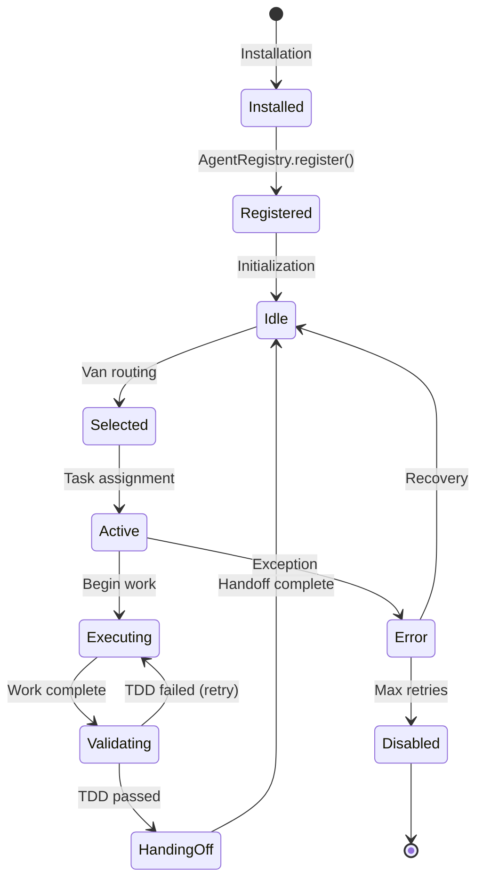
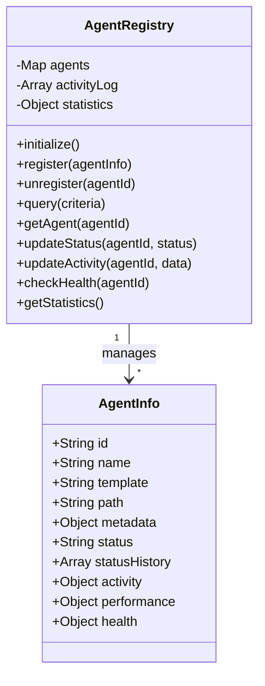
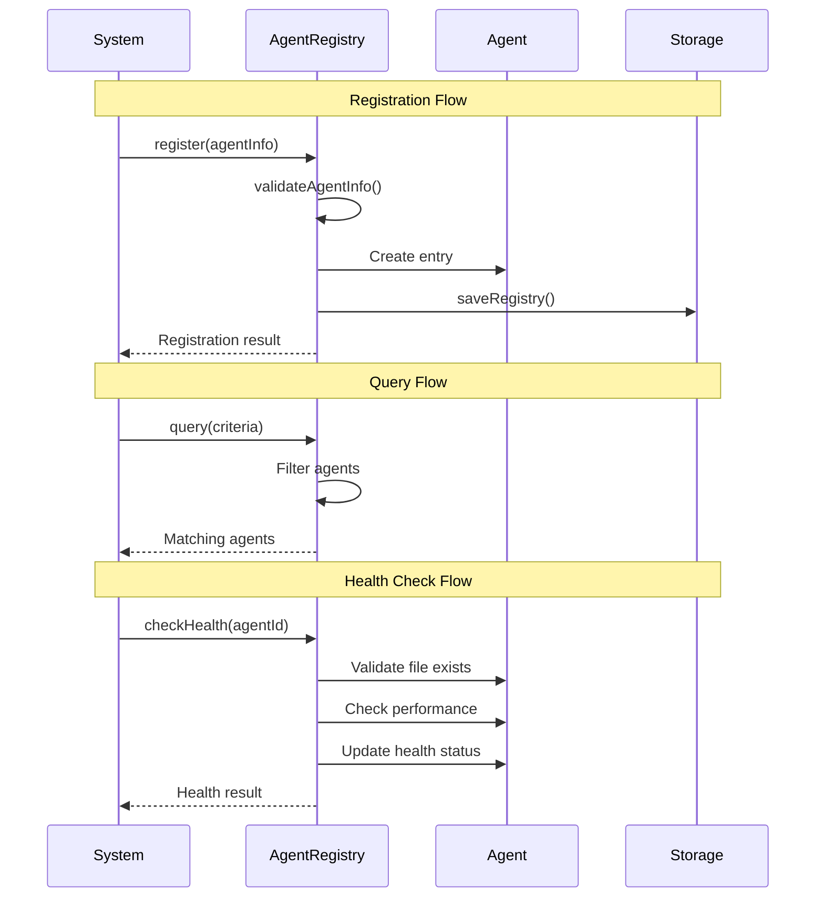
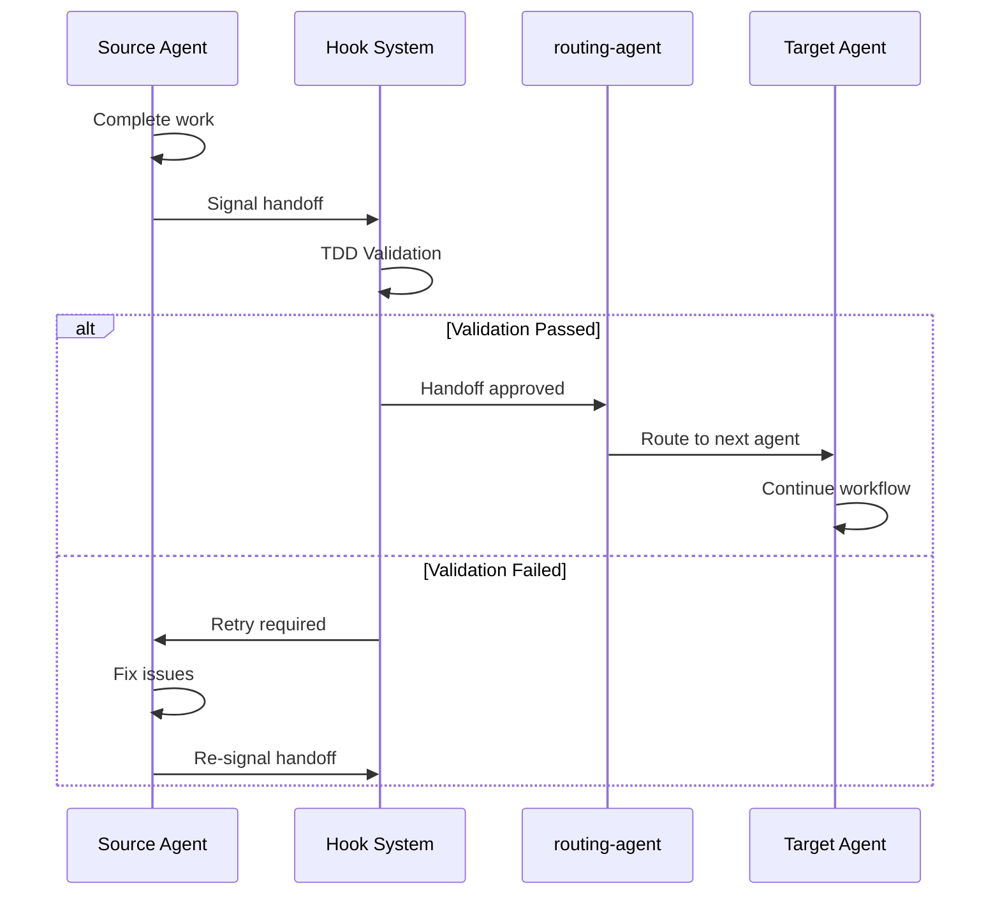
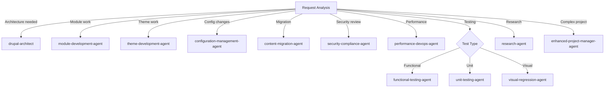
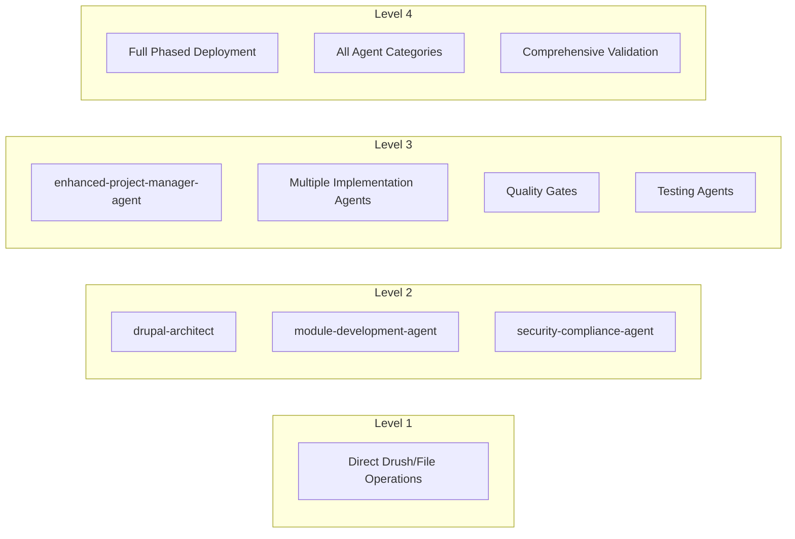
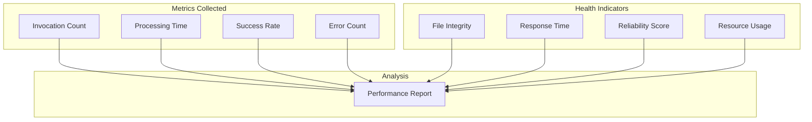
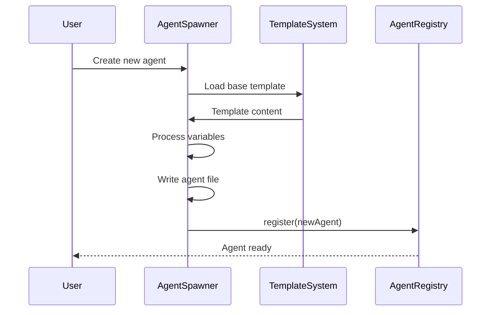

# Agent System Architecture

This document describes the agent system, including agent types, lifecycle management, and coordination patterns.

## Agent Overview

The collective includes 15 specialized agents organized into functional categories:

```mermaid
graph TB
    subgraph "Coordination (1)"
        ROUTING[routing-agent<br/>Hub Controller]
    end

    subgraph "Core Drupal (5)"
        ARCH[drupal-architect]
        MOD[module-development-agent]
        THEME[theme-development-agent]
        CONFIG[configuration-management-agent]
        MIGRATE[content-migration-agent]
    end

    subgraph "Quality & Security (2)"
        SECURITY[security-compliance-agent]
        PERF[performance-devops-agent]
    end

    subgraph "Testing (3)"
        FUNC[functional-testing-agent]
        UNIT[unit-testing-agent]
        VIS[visual-regression-agent]
    end

    subgraph "Project Management (4)"
        PM[enhanced-project-manager-agent]
        RESEARCH[research-agent]
        WORKFLOW[workflow-agent]
        SEMANTIC[semantic-architect-agent]
    end

    ROUTING --> ARCH
    ROUTING --> MOD
    ROUTING --> THEME
    ROUTING --> CONFIG
    ROUTING --> MIGRATE
    ROUTING --> SECURITY
    ROUTING --> PERF
    ROUTING --> FUNC
    ROUTING --> UNIT
    ROUTING --> VIS
    ROUTING --> PM
    ROUTING --> RESEARCH
    ROUTING --> WORKFLOW
    ROUTING --> SEMANTIC
```



## Agent Categories

### 1. Coordination Agent

| Agent | Purpose | Key Capabilities |
|-------|---------|------------------|
| **routing-agent** | Central hub for all request routing | Request analysis, agent selection, coordination |

### 2. Core Drupal Agents

| Agent | Purpose | Key Capabilities |
|-------|---------|------------------|
| **drupal-architect** | Site architecture design | Content modeling, module selection, system design |
| **module-development-agent** | Custom module creation | Drupal 10/11 APIs, dependency injection, Entity API |
| **theme-development-agent** | Theme development | Twig templates, SCSS, JavaScript behaviors |
| **configuration-management-agent** | Config export/import | Update hooks, deployment configuration |
| **content-migration-agent** | Data migration | Migration plugins, content transformation |

### 3. Quality & Security Agents

| Agent | Purpose | Key Capabilities |
|-------|---------|------------------|
| **security-compliance-agent** | Consolidated quality validation | Standards, security, performance, accessibility |
| **performance-devops-agent** | Caching & deployment | Performance optimization, CI/CD setup |

### 4. Testing Agents

| Agent | Purpose | Key Capabilities |
|-------|---------|------------------|
| **functional-testing-agent** | Browser automation | Playwright testing, user journey validation |
| **unit-testing-agent** | PHPUnit testing | Drupal test base, kernel tests |
| **visual-regression-agent** | Screenshot comparison | Visual diff testing |

### 5. Project Management Agents

| Agent | Purpose | Key Capabilities |
|-------|---------|------------------|
| **enhanced-project-manager-agent** | TaskMaster coordination | Task breakdown, dependency management |
| **research-agent** | Technical research | Context7 integration, best practices |
| **workflow-agent** | Complex orchestration | Multi-agent workflows |
| **semantic-architect-agent** | Documentation mapping | Knowledge graph, code-business logic mapping |

## Agent Lifecycle



## Agent Registry

The `AgentRegistry` class manages all agent lifecycle:



### Registry Operations



## Agent Communication

### Hub-and-Spoke Pattern

All communication flows through the central hub (routing-agent):

```mermaid
flowchart TB
    subgraph "Incoming"
        REQ[User Request]
    end

    subgraph "Hub"
        VAN[/van Command<br/>routing-agent]
    end

    subgraph "Outgoing"
        A1[Agent 1]
        A2[Agent 2]
        A3[Agent 3]
    end

    subgraph "Return"
        RES[Response]
    end

    REQ --> VAN
    VAN --> A1
    VAN --> A2
    VAN --> A3
    A1 --> VAN
    A2 --> VAN
    A3 --> VAN
    VAN --> RES

    style VAN fill:#f9f,stroke:#333,stroke-width:4px
```

### Handoff Protocol



## Agent Definition Structure

Each agent is defined in a Markdown file with YAML frontmatter:

```markdown
---
name: module-development-agent
description: Creates custom Drupal modules following best practices
tools:
  - Read
  - Write
  - Edit
  - Bash
  - Grep
  - Glob
capabilities:
  - Drupal 10/11 module development
  - Dependency injection patterns
  - Entity API usage
  - Service registration
---

# Module Development Agent

## Purpose
[Agent description and responsibilities]

## Workflow
[Step-by-step process]

## Quality Standards
[Requirements for completion]

## Handoff Template
[Format for handoff messages]
```

## Agent Selection Matrix

The routing-agent uses this matrix for agent selection:



## Complexity-Based Routing

| Level | Description | Agents Used | Example |
|-------|-------------|-------------|---------|
| **1** | Simple config/edits | 0 (direct execution) | Add field, enable module |
| **2** | Single feature | 2-4 | Custom block, form |
| **3** | Multi-component | 5-9 | FAQ system, member directory |
| **4** | Full project | 8-12+ | Complete site build |



## Agent Performance Tracking



## Dynamic Agent Creation

The system supports creating new agents at runtime:



## See Also

- [OVERVIEW.md](./OVERVIEW.md) - System architecture overview
- [HOOKS.md](./HOOKS.md) - Hook system and TDD validation
- [INSTALLATION.md](./INSTALLATION.md) - Agent installation process
