# Command System Architecture

This document describes the command parsing, execution, and slash command systems.

## Command System Overview

The collective provides a multi-layer command system:

```mermaid
graph TB
    subgraph "User Input"
        NATURAL[Natural Language]
        SLASH[Slash Commands]
        VAN[/van Command]
    end

    subgraph "Command Processing"
        PARSER[CollectiveCommandParser]
        AUTOCOMPLETE[CommandAutocomplete]
        HELP[CommandHelpSystem]
    end

    subgraph "Execution"
        SYSTEM[CommandSystem]
        HISTORY[CommandHistoryManager]
        METRICS[Command Metrics]
    end

    NATURAL --> PARSER
    SLASH --> PARSER
    VAN --> PARSER

    PARSER --> SYSTEM
    PARSER --> AUTOCOMPLETE
    SYSTEM --> HISTORY
    SYSTEM --> METRICS
    PARSER --> HELP
```

## Command System Components

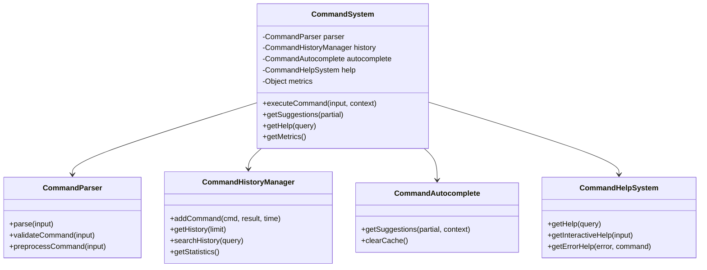

## Command Execution Flow

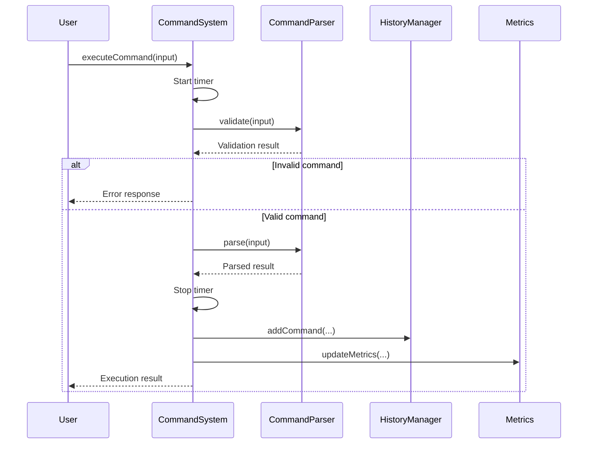

## Van Routing Command

The `/van` command is the primary entry point for collective routing:

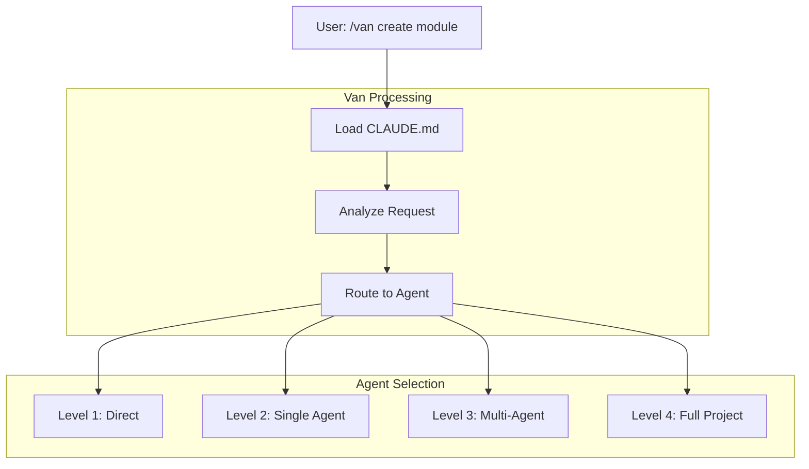

### Routing Decision Matrix

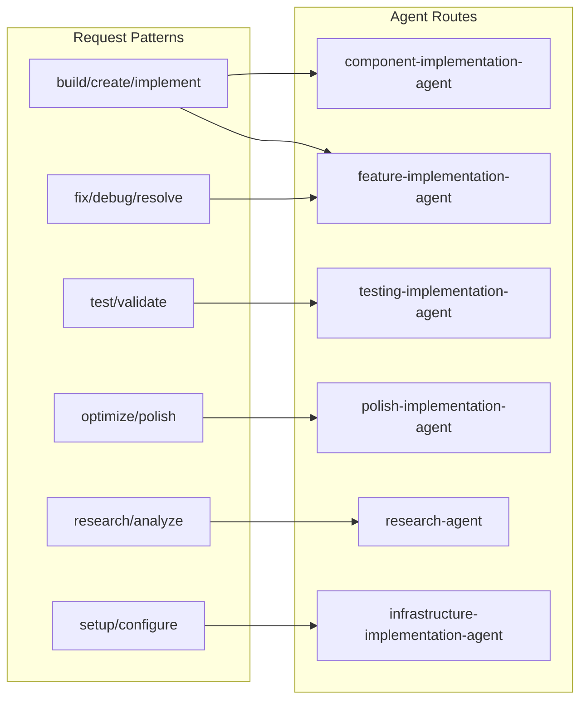

## TaskMaster Commands

The `/tm` command namespace provides TaskMaster integration:

```mermaid
graph TB
    TM[/tm]

    subgraph "Project Setup"
        INIT[/tm/init]
        PARSE[/tm/parse-prd]
    end

    subgraph "Task Management"
        LIST[/tm/list]
        SHOW[/tm/show]
        NEXT[/tm/next]
        STATUS[/tm/set-status]
    end

    subgraph "Task Operations"
        ADD[/tm/add-task]
        EXPAND[/tm/expand]
        UPDATE[/tm/update]
    end

    subgraph "Analysis"
        ANALYZE[/tm/analyze-complexity]
        REPORT[/tm/complexity-report]
    end

    TM --> INIT
    TM --> PARSE
    TM --> LIST
    TM --> SHOW
    TM --> NEXT
    TM --> STATUS
    TM --> ADD
    TM --> EXPAND
    TM --> UPDATE
    TM --> ANALYZE
    TM --> REPORT
```

## Command Autocomplete

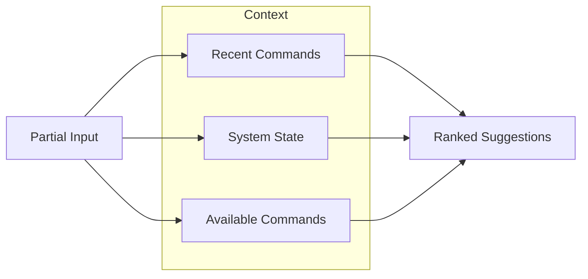

### Suggestion Ranking

```mermaid
graph TD
    INPUT[User Types: /tm l]

    MATCH[Pattern Match]

    S1[/tm/list - High: exact prefix]
    S2[/tm/learn - Medium: prefix match]
    S3[/tm/list-tasks - Low: substring]

    RANK[Rank by frequency]
    RESULT[Ordered Suggestions]

    INPUT --> MATCH
    MATCH --> S1
    MATCH --> S2
    MATCH --> S3
    S1 --> RANK
    S2 --> RANK
    S3 --> RANK
    RANK --> RESULT
```

## Command History

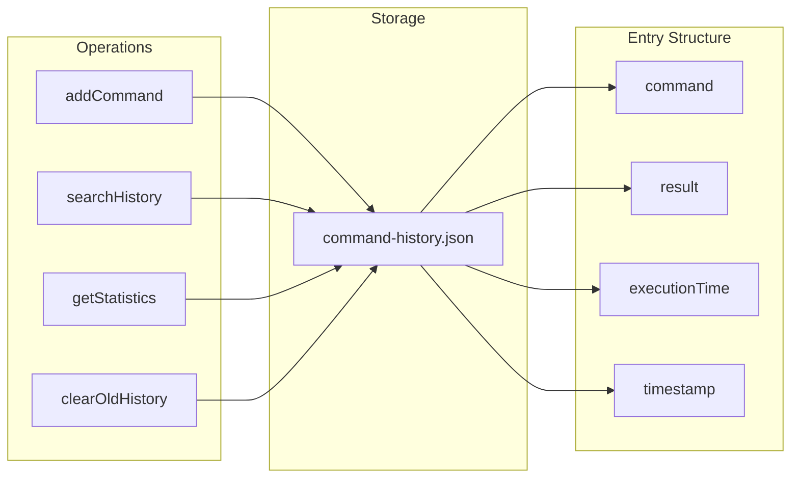

## Command Metrics

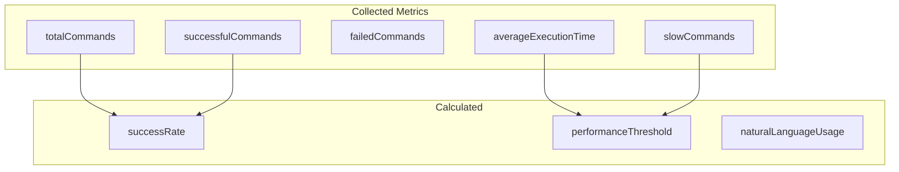

## Command Preprocessing

Before execution, commands are preprocessed:

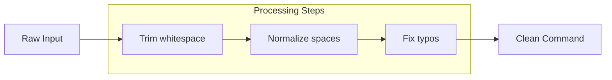

### Typo Corrections

| Typo | Correction |
|------|------------|
| `/collecitve` | `/collective` |
| `/agnet` | `/agent` |
| `/gaet` | `/gate` |
| `stauts` | `status` |
| `lsit` | `list` |

## Command Validation

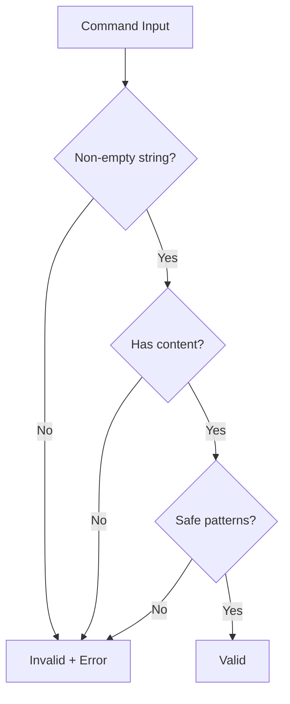

### Dangerous Pattern Detection

```mermaid
graph TD
    CMD[Command]

    subgraph "Blocked Patterns"
        P1[rm -rf]
        P2[sudo rm]
        P3[../../..]
        P4[system\(]
        P5[exec\(]
    end

    CHECK{Contains pattern?}
    BLOCK[Block execution]
    ALLOW[Allow execution]

    CMD --> CHECK
    P1 --> CHECK
    P2 --> CHECK
    P3 --> CHECK
    P4 --> CHECK
    P5 --> CHECK

    CHECK --> |Yes| BLOCK
    CHECK --> |No| ALLOW
```

## Batch Command Execution

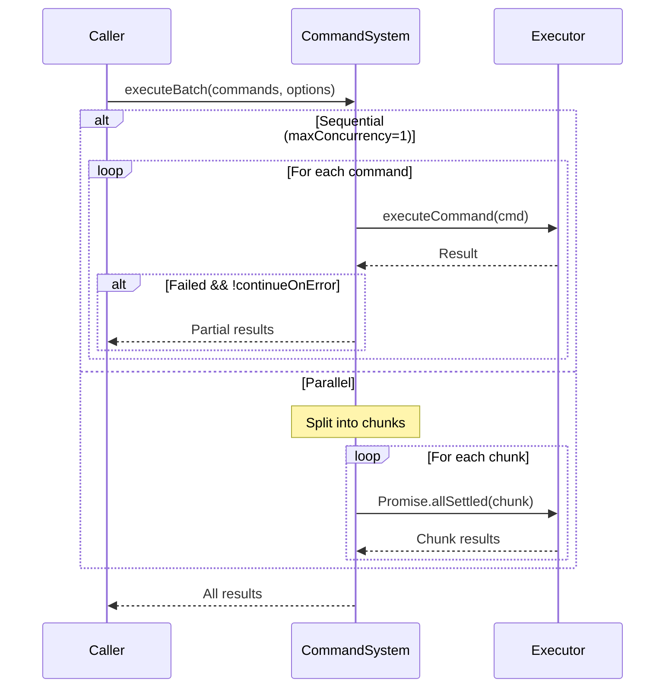

## Help System

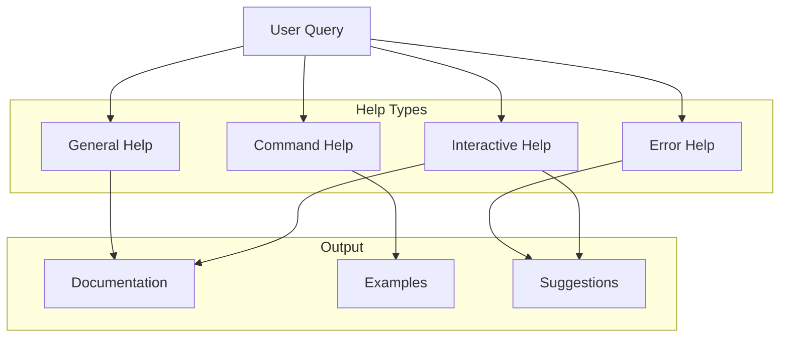

## Command Export

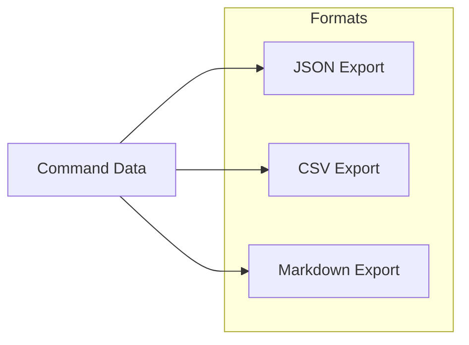

### Export Contents

| Format | Includes |
|--------|----------|
| **JSON** | Full metrics, history, system state |
| **CSV** | Command history (timestamp, command, result) |
| **Markdown** | Metrics summary, recent commands table |

## Slash Command Structure

Each slash command is defined in a Markdown file:

```markdown
---
name: command-name
description: What the command does
arguments: Optional arguments pattern
---

# Command Title

[Command instructions and steps]
```

### Command Directory Structure

```
.claude/commands/
├── van.md                    # Main routing command
├── autocompact.md            # Context management
├── reset-handoff.md          # Reset handoff state
├── continue-handoff.md       # Continue handoff chain
└── tm/                       # TaskMaster namespace
    ├── init/
    │   └── init-project.md
    ├── list/
    │   ├── list-tasks.md
    │   └── list-tasks-with-subtasks.md
    ├── show/
    │   └── show-task.md
    ├── set-status/
    │   ├── to-done.md
    │   ├── to-in-progress.md
    │   └── to-pending.md
    └── ...
```

## Data Flow

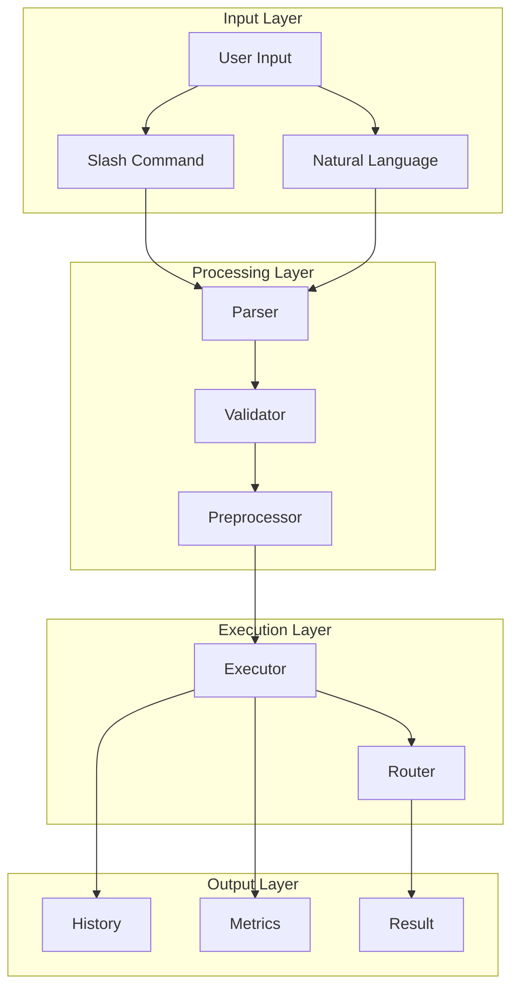

## System Maintenance

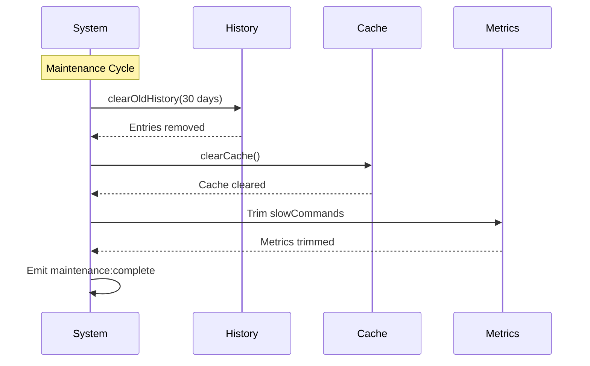

## See Also

- [OVERVIEW.md](./OVERVIEW.md) - System architecture overview
- [AGENTS.md](./AGENTS.md) - Agent routing via commands
- [HOOKS.md](./HOOKS.md) - Command enforcement hooks
