# Hook System Architecture

This document describes the hook system that enforces behavioral rules, validates handoffs, and collects research metrics.

## Hook Overview

The collective includes 8 enforcement hooks that integrate with Claude Code's hook system:

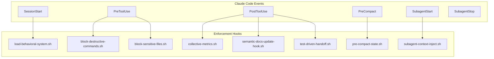

## Hook Descriptions

| Hook | Event | Lines | Purpose |
|------|-------|-------|---------|
| **load-behavioral-system.sh** | SessionStart | 18 | Loads INDEX.md + DECISION.md at startup, recovers compact state |
| **block-destructive-commands.sh** | PreToolUse | 242 | Security: blocks rm -rf, force push, etc. |
| **block-sensitive-files.sh** | PreToolUse | 220 | Security: blocks Read/Grep on .env, settings.php, credentials |
| **collective-metrics.sh** | PostToolUse | 106 | Collects routing, performance, research metrics |
| **semantic-docs-update-hook.sh** | PostToolUse | 75 | Reminds to update semantic docs after dev tasks |
| **test-driven-handoff.sh** | PostToolUse/SubagentStop | 172 | TDD validation and handoff chaining |
| **pre-compact-state.sh** | PreCompact | ~40 | Saves active agent/task state before context compaction |
| **subagent-context-inject.sh** | SubagentStart | ~60 | Validates agent name, injects recovery context and memory path |

## Hook Flow

### Complete Request Lifecycle

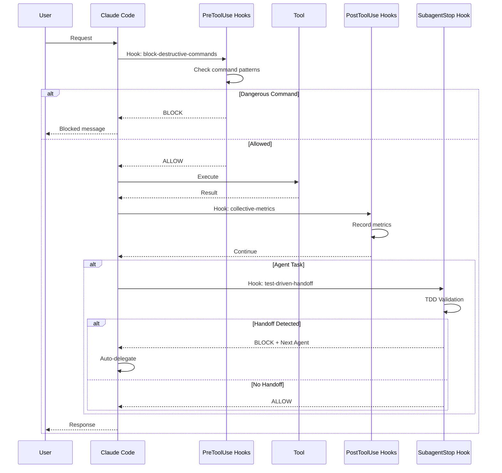

## Test-Driven Handoff Hook

The most complex hook, responsible for TDD validation and workflow automation:

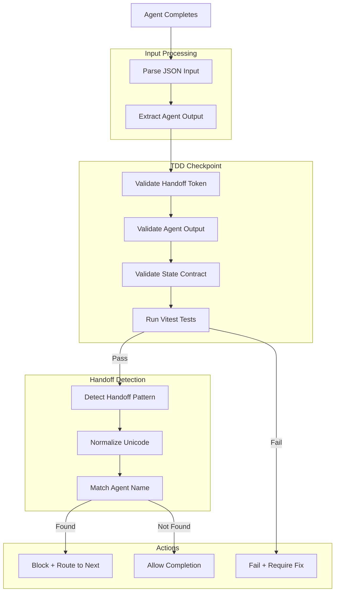

### Handoff Pattern Detection

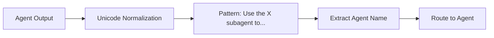

## Hook Configuration

Hooks are configured in `.claude/settings.json`:

```json
{
  "hooks": {
    "SessionStart": [
      {
        "matcher": {},
        "hooks": [{ "type": "command", "command": ".claude/hooks/load-behavioral-system.sh" }]
      }
    ],
    "PreToolUse": [
      {
        "matcher": { "toolName": "Bash" },
        "hooks": [{ "type": "command", "command": ".claude/hooks/block-destructive-commands.sh" }]
      },
      {
        "matcher": { "toolName": "Read|Grep" },
        "hooks": [{ "type": "command", "command": ".claude/hooks/block-sensitive-files.sh" }]
      }
    ],
    "PostToolUse": [
      {
        "matcher": { "toolName": ".*" },
        "hooks": [
          { "type": "command", "command": ".claude/hooks/collective-metrics.sh" },
          { "type": "command", "command": ".claude/hooks/semantic-docs-update-hook.sh" }
        ]
      },
      {
        "matcher": { "toolName": "Task" },
        "hooks": [{ "type": "command", "command": ".claude/hooks/test-driven-handoff.sh" }]
      }
    ],
    "PreCompact": [
      {
        "matcher": {},
        "hooks": [{ "type": "command", "command": ".claude/hooks/pre-compact-state.sh" }]
      }
    ],
    "SubagentStart": [
      {
        "matcher": { "agentName": ".*" },
        "hooks": [{ "type": "command", "command": ".claude/hooks/subagent-context-inject.sh" }]
      }
    ],
    "SubagentStop": [
      {
        "matcher": {},
        "hooks": [{ "type": "command", "command": ".claude/hooks/test-driven-handoff.sh" }]
      }
    ]
  }
}
```

## Hook Response Types

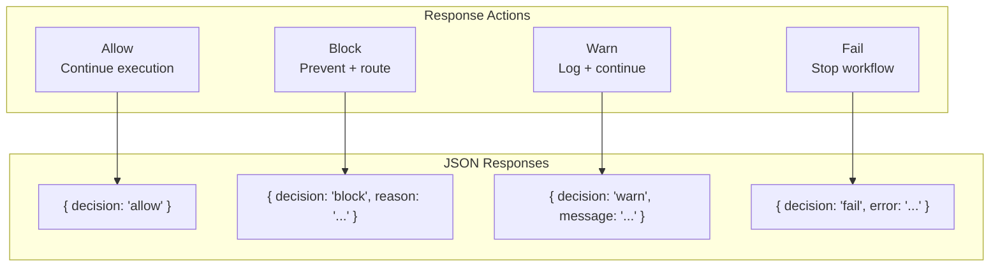

## TDD Validation Checkpoints

### Agent-Level Checkpoint

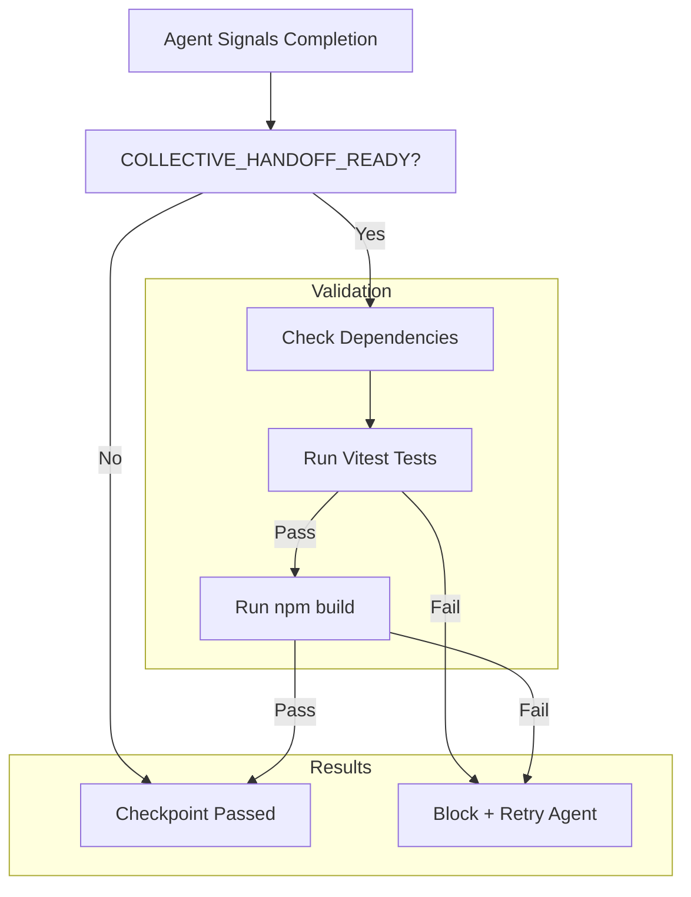

### Orchestrator Phase Checkpoint

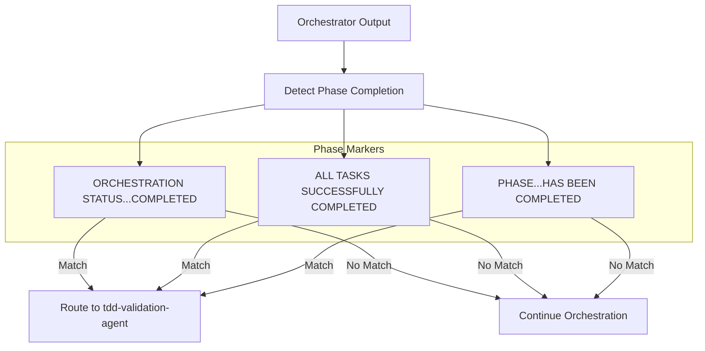

## Metrics Collection Hook

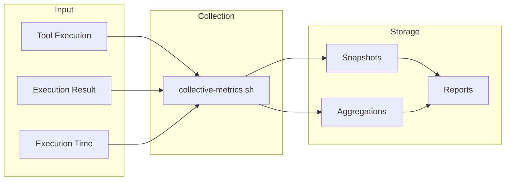

## Security Hooks

### Block Destructive Commands

```mermaid
graph TD
    CMD[Command Input]

    subgraph "Dangerous Patterns"
        P1[rm -rf]
        P2[sudo rm]
        P3[../../..]
        P4[system\(\"]
        P5[exec\(]
    end

    CHECK{Pattern Match?}
    BLOCK[Block Execution]
    ALLOW[Allow Execution]

    CMD --> CHECK
    CHECK --> |Match| BLOCK
    CHECK --> |No Match| ALLOW

    P1 --> CHECK
    P2 --> CHECK
    P3 --> CHECK
    P4 --> CHECK
    P5 --> CHECK
```

### Sensitive File Protection

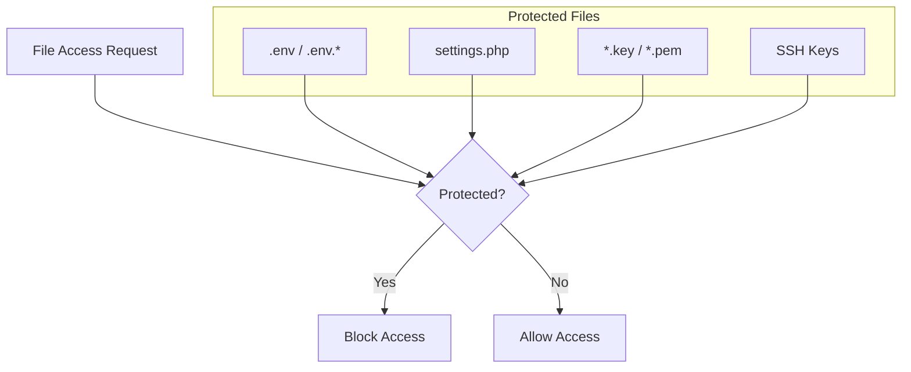

## Hook Data Flow

```mermaid
flowchart LR
    subgraph "Input Sources"
        STDIN[stdin: JSON]
        ENV[Environment Variables]
        FILES[Project Files]
    end

    subgraph "Processing"
        HOOK[Hook Script]
    end

    subgraph "Output Destinations"
        STDOUT[stdout: JSON Response]
        STDERR[stderr: User Messages]
        LOG[/tmp/*.log]
        METRICS[.claude-collective/metrics/]
    end

    STDIN --> HOOK
    ENV --> HOOK
    FILES --> HOOK

    HOOK --> STDOUT
    HOOK --> STDERR
    HOOK --> LOG
    HOOK --> METRICS
```

## Error Handling

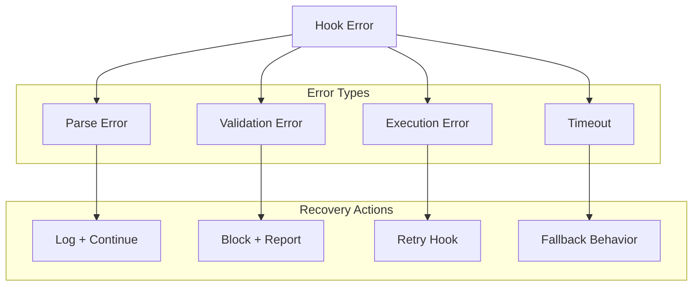

## Hook Development Guidelines

### Input Processing

```bash
# Read JSON from stdin
INPUT_JSON=$(cat | sed 's/\\!/!/g')

# Parse with jq (preferred)
EVENT=$(echo "$INPUT_JSON" | jq -r '.hook_event_name')

# Fallback to grep/sed
EVENT=$(echo "$INPUT_JSON" | grep -o '"hook_event_name":"[^"]*"' | cut -d'"' -f4)
```

### Response Format

```bash
# Allow action
cat <<EOF
{
  "decision": "allow"
}
EOF

# Block with reason
cat <<EOF
{
  "decision": "block",
  "reason": "Explanation for user"
}
EOF
```

### Logging

```bash
LOG_FILE="/tmp/hook-name.log"
log() {
    echo "[$(date '+%Y-%m-%d %H:%M:%S')] $1" >> "$LOG_FILE"
}

# User-visible messages go to stderr
echo "User message" >&2
```

## PreCompact Hook (v2.1)

Saves active agent state before context compaction to prevent losing task context.

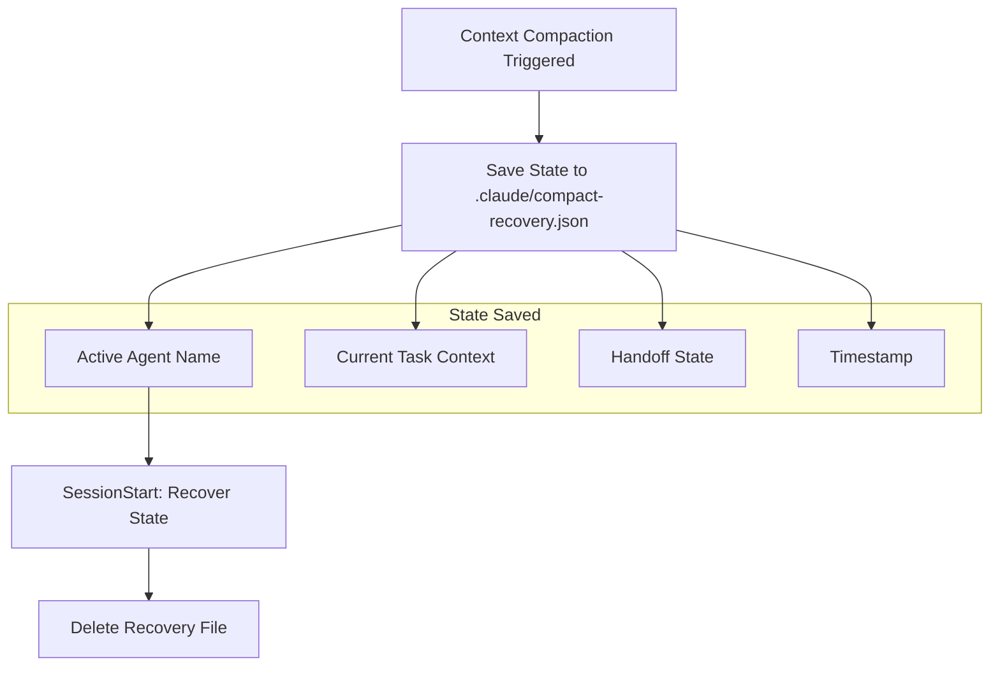

### Recovery Flow

The `load-behavioral-system.sh` hook checks for the recovery file on SessionStart:
1. If `.claude/compact-recovery.json` exists, reads and outputs saved state
2. Injects recovered context into the session
3. Deletes the recovery file after successful injection

## SubagentStart Hook (v2.1)

Validates agent names and injects project context when agents spawn.

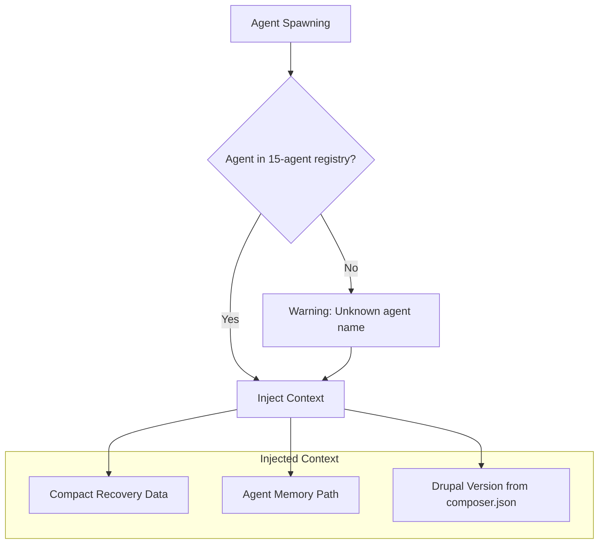

### Agent Registry Validation

The hook validates against the 15 known agents:
- routing-agent, drupal-architect, module-development-agent
- theme-development-agent, configuration-management-agent, content-migration-agent
- security-compliance-agent, performance-devops-agent
- functional-testing-agent, unit-testing-agent, visual-regression-agent
- enhanced-project-manager-agent, research-agent, workflow-agent, semantic-architect-agent

Unknown agent names are logged as warnings but execution continues.

## Shared Utilities (lib/hook-utils.sh)

All hooks source `lib/hook-utils.sh` for:
- JSON parsing (with jq fallback to grep/sed)
- Unicode dash normalization for handoff pattern matching
- Handoff pattern detection
- Logging utilities

## See Also

- [OVERVIEW.md](./OVERVIEW.md) - System architecture overview
- [AGENTS.md](./AGENTS.md) - Agent system and handoffs
- [METRICS.md](./METRICS.md) - Research metrics collection
