# Installation System Architecture

This document describes the installation process, file mapping, template processing, and configuration management.

## Installation Overview

The collective is installed via NPX with an interactive or express mode:

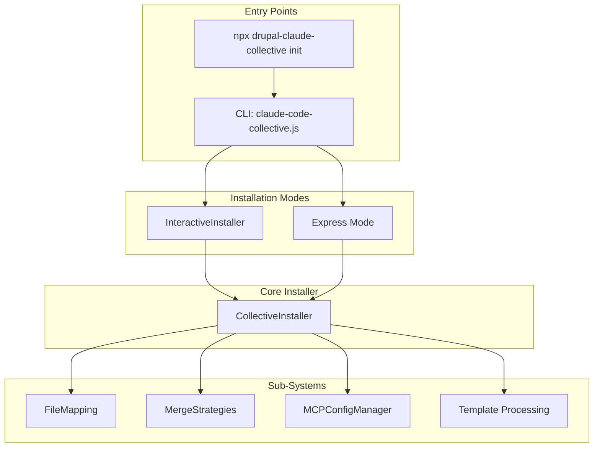

## Installation Sequence

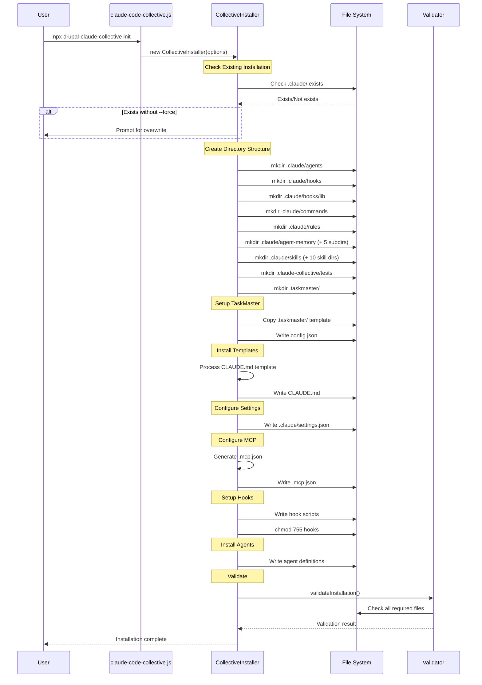

## File Mapping System

The `FileMapping` class manages template-to-target file relationships:

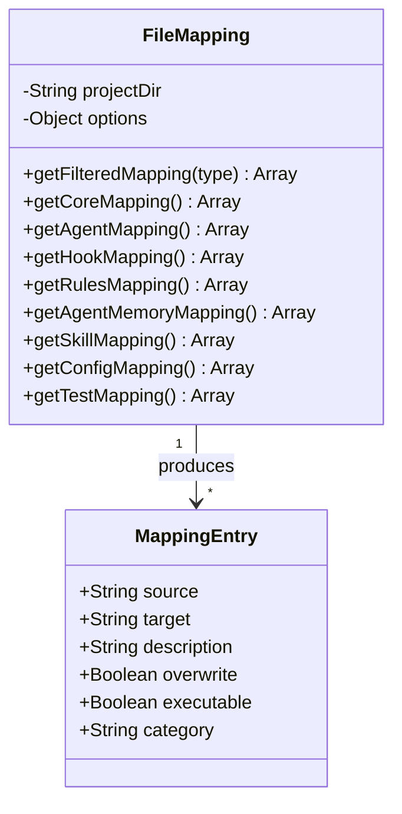

### Mapping Categories

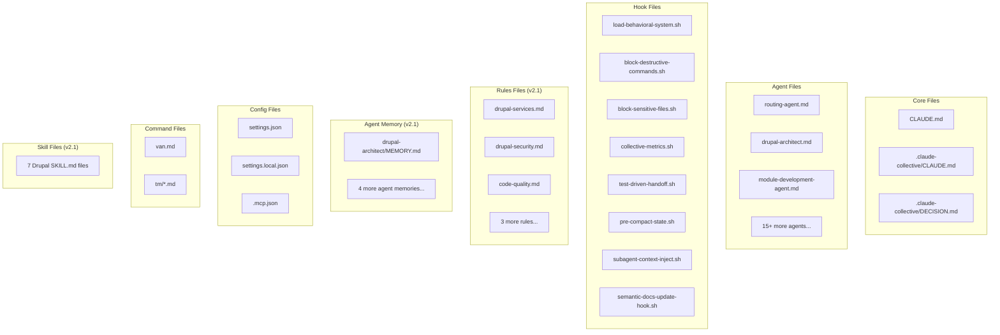

## Template Processing

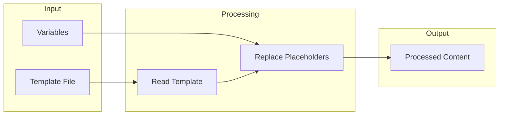

### Template Variables

| Variable | Description | Example |
|----------|-------------|---------|
| `{{PROJECT_ROOT}}` | Absolute project path | `/home/user/drupal-site` |
| `{{INSTALL_DATE}}` | Installation timestamp | `2024-01-15T10:30:00Z` |
| `{{VERSION}}` | Collective version | `1.5.2` |
| `{{USER_NAME}}` | Current user | `developer` |
| `{{PROJECT_NAME}}` | Project directory name | `my-drupal-site` |

## Merge Strategies

When files already exist, the `MergeStrategies` class handles conflicts:

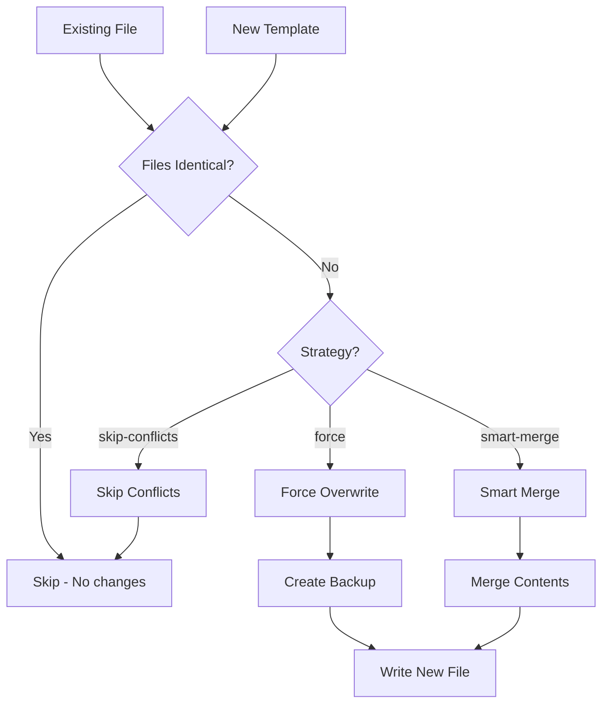

### Smart Merge for Settings

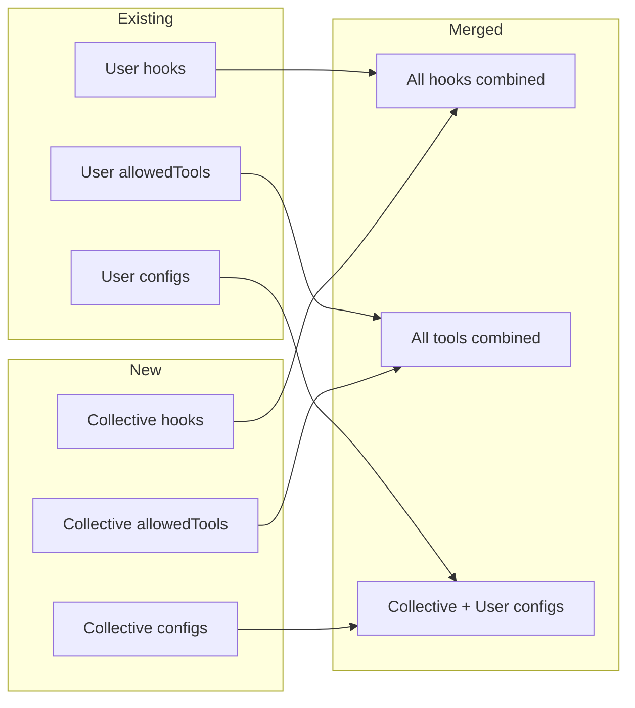

## MCP Configuration

The `MCPConfigManager` generates `.mcp.json`:

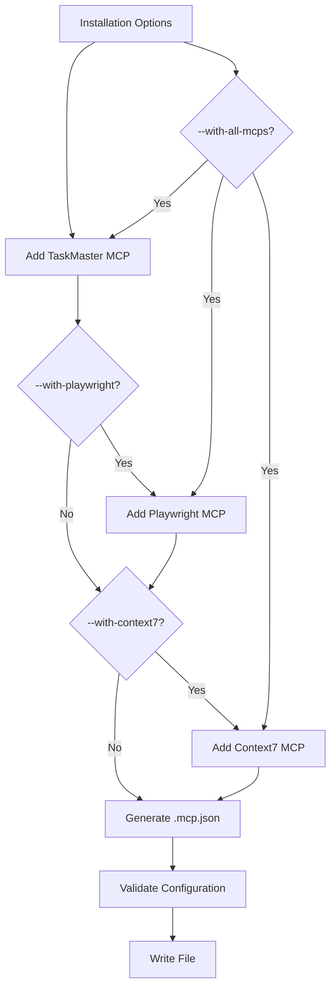

### MCP Server Profiles

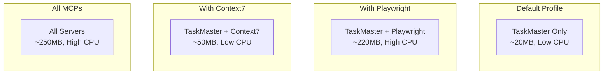

## Directory Creation

```mermaid
graph TB
    ROOT[Project Root]

    ROOT --> CLAUDE[.claude/]
    CLAUDE --> AGENTS[agents/]
    CLAUDE --> HOOKS[hooks/]
    HOOKS --> HOOKLIB[lib/]
    CLAUDE --> COMMANDS[commands/]
    CLAUDE --> RULES[rules/ v2.1]
    CLAUDE --> AGENTMEM[agent-memory/ v2.1]
    AGENTMEM --> AM1[drupal-architect/]
    AGENTMEM --> AM2[module-development-agent/]
    AGENTMEM --> AM3[security-compliance-agent/]
    AGENTMEM --> AM4[research-agent/]
    AGENTMEM --> AM5[configuration-management-agent/]
    CLAUDE --> SKILLS[skills/]
    SKILLS --> SK1[semantic-docs/]
    SKILLS --> SK2[drupal-entity-api/ v2.1]
    SKILLS --> SK3[drupal-service-di/ v2.1]
    SKILLS --> SK4[7 more skills...]

    ROOT --> COLLECTIVE[.claude-collective/]
    COLLECTIVE --> TESTS[tests/]
    TESTS --> HANDOFFS[handoffs/]
    TESTS --> DIRECTIVES[directives/]
    TESTS --> CONTRACTS[contracts/]
    COLLECTIVE --> METRICS[metrics/]

    ROOT --> TASKMASTER[.taskmaster/]
    TASKMASTER --> TASKS[tasks/]
    TASKMASTER --> DOCS[docs/]
    TASKMASTER --> REPORTS[reports/]
    TASKMASTER --> TEMPLATES[templates/]
```

## Installation Options

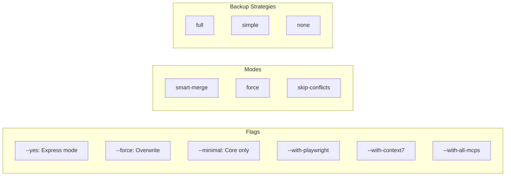

## Validation

Post-installation validation ensures all required files exist:

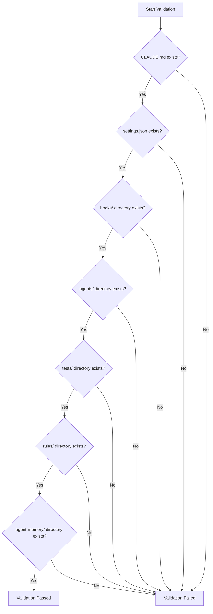

## Installation Status

The `getInstallationStatus()` method checks current state:

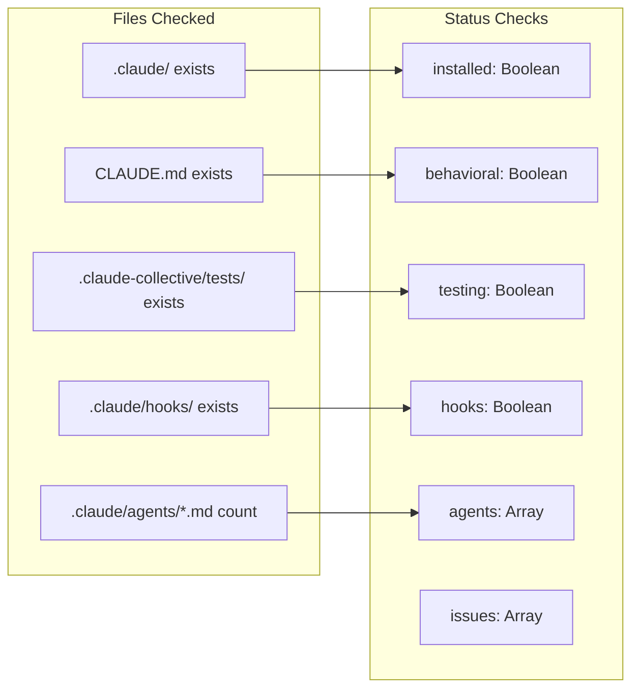

## Repair Process

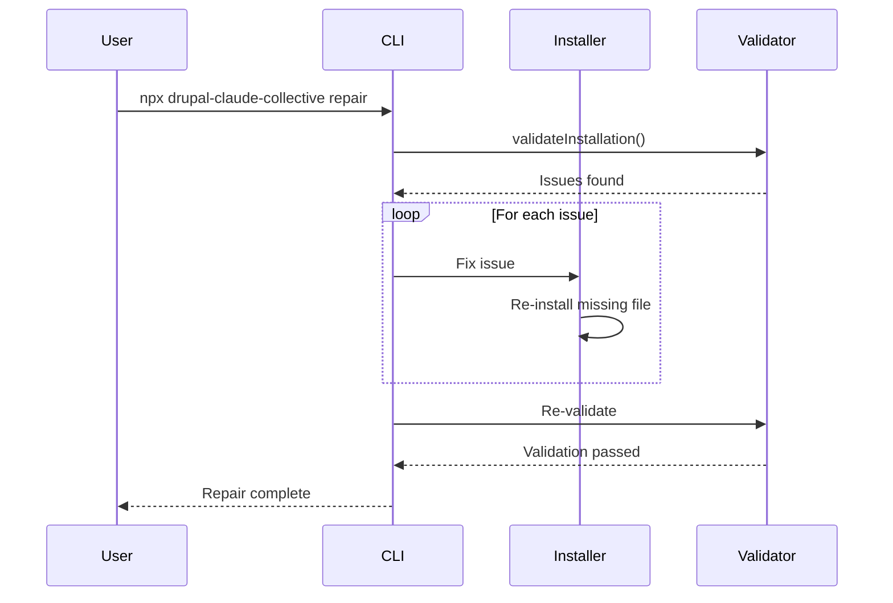

## Clean Uninstall

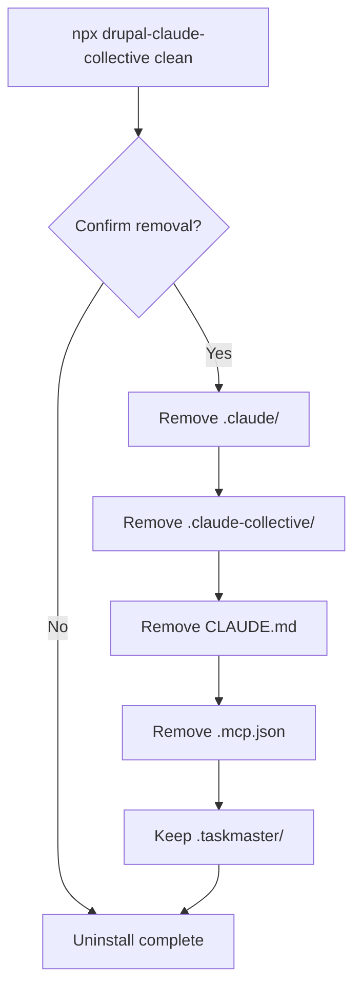

## Data Flow Summary

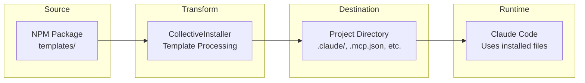

## See Also

- [OVERVIEW.md](./OVERVIEW.md) - System architecture overview
- [AGENTS.md](./AGENTS.md) - Agent installation details
- [HOOKS.md](./HOOKS.md) - Hook installation and configuration
