# Research Metrics Architecture

This document describes the metrics collection system used to validate research hypotheses about agent coordination patterns.

## Research Hypotheses

The collective is designed to validate three core hypotheses:

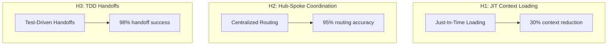

## Metrics System Components

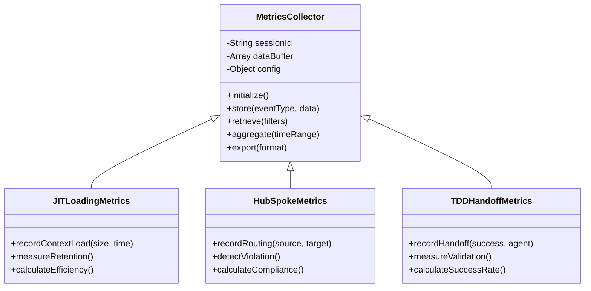

## H1: JIT Context Loading

### Theory

On-demand context loading is more efficient than pre-loading all behavioral rules.

### Metrics Collected

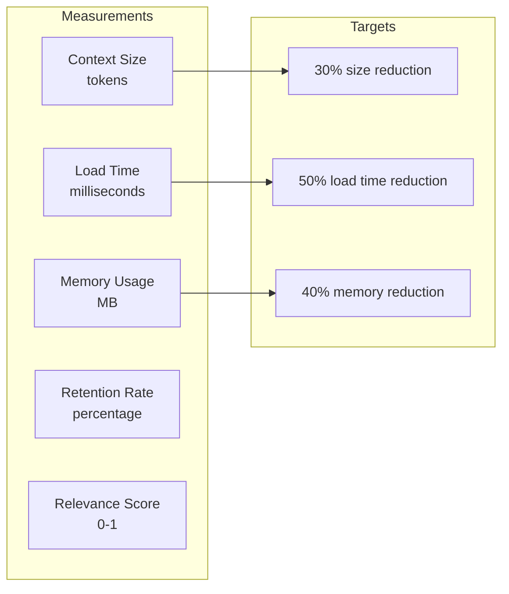

### Data Collection Flow

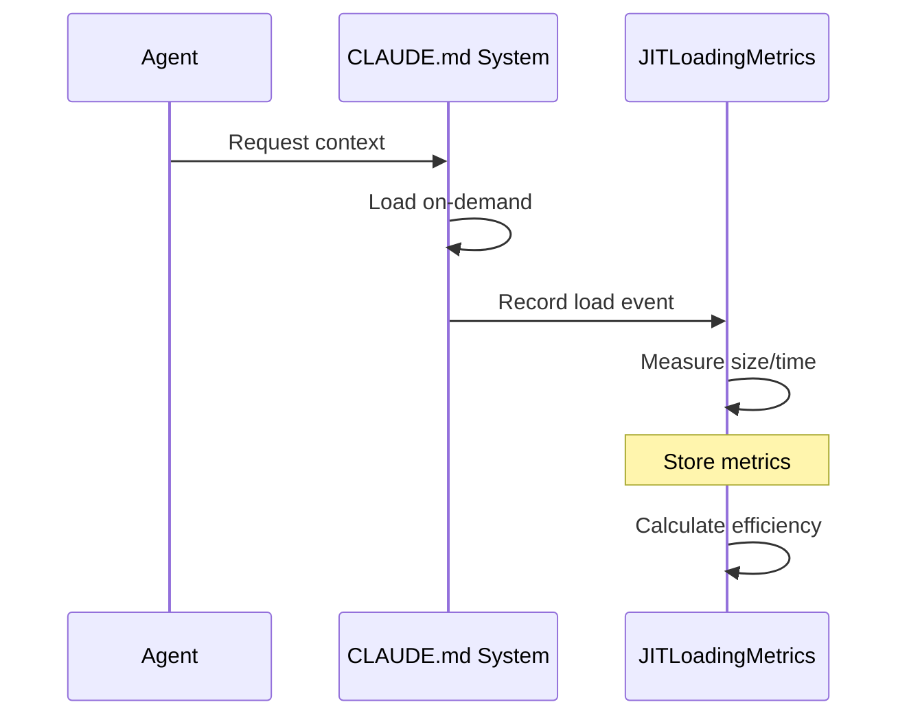

## H2: Hub-Spoke Coordination

### Theory

Centralized routing through a hub outperforms distributed peer-to-peer agent communication.

### Metrics Collected

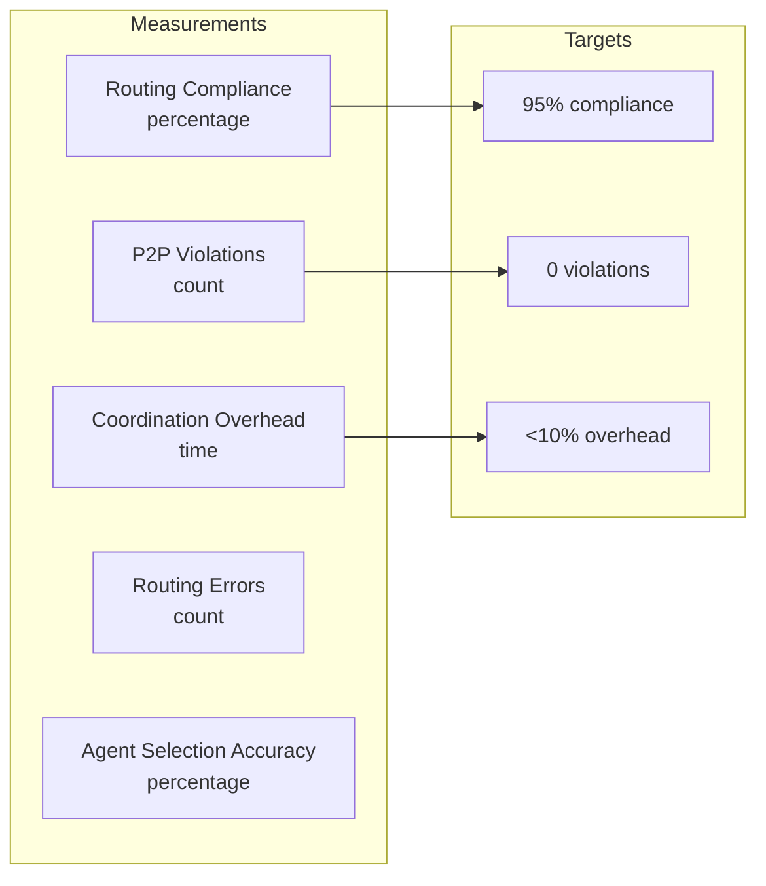

### Violation Detection

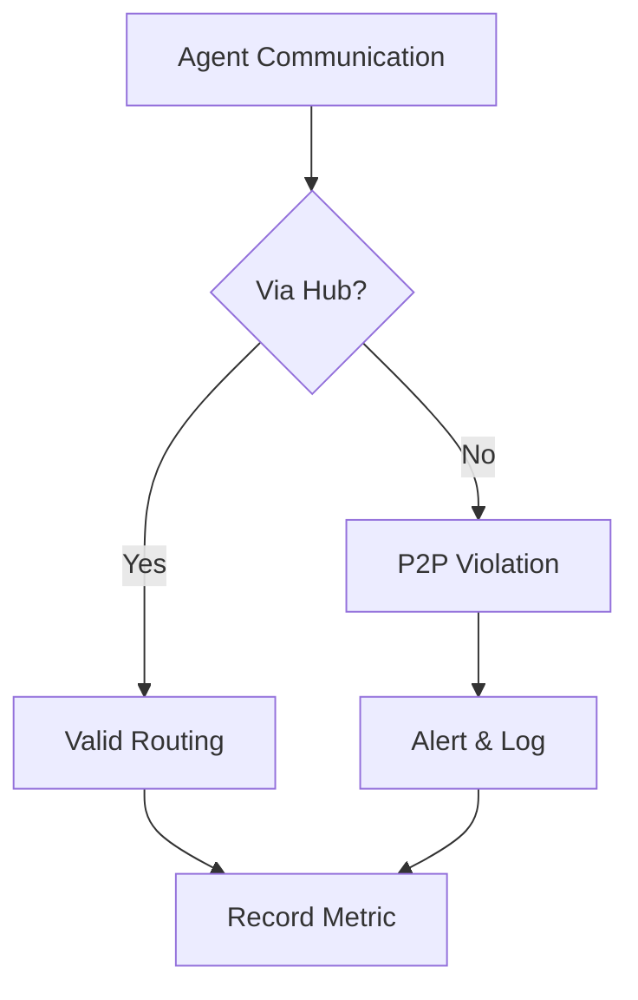

## H3: TDD Handoffs

### Theory

Test-driven, contract-based handoffs improve quality and reduce integration failures.

### Metrics Collected

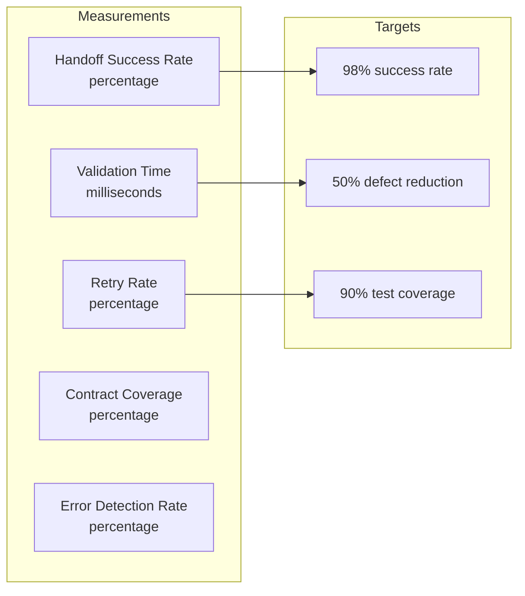

### Handoff Validation Flow

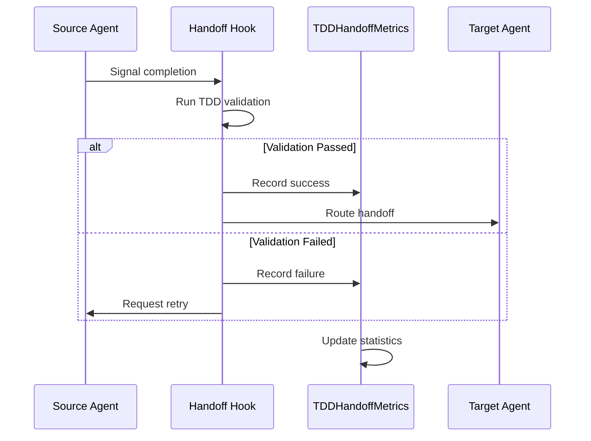

## Metrics Storage

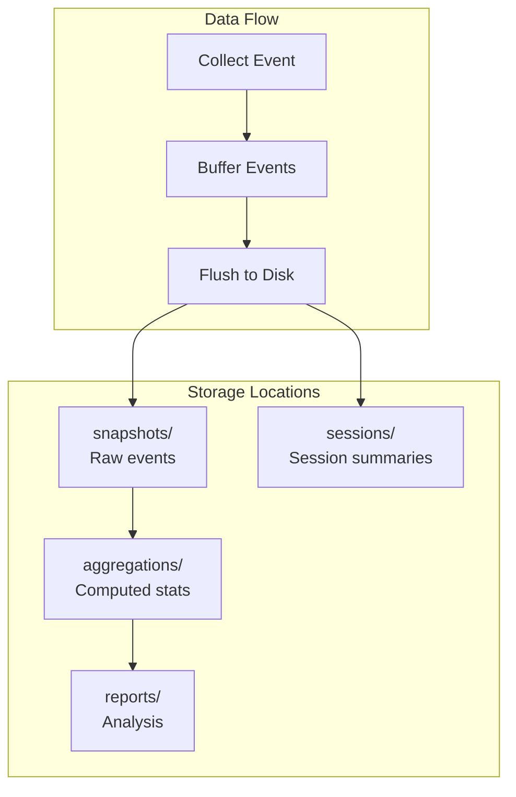

### Directory Structure

```
.claude-collective/metrics/
├── snapshots/               # Raw metric events
│   └── snapshot-{timestamp}.json
├── aggregations/            # Computed aggregations
│   └── aggregation-{timestamp}.json
├── reports/                 # Analysis reports
│   └── report-{date}.md
├── sessions/                # Session summaries
│   └── {sessionId}.json
├── baseline.json            # Pre-collective baseline
└── config.json              # Metrics configuration
```

## Baseline Comparison

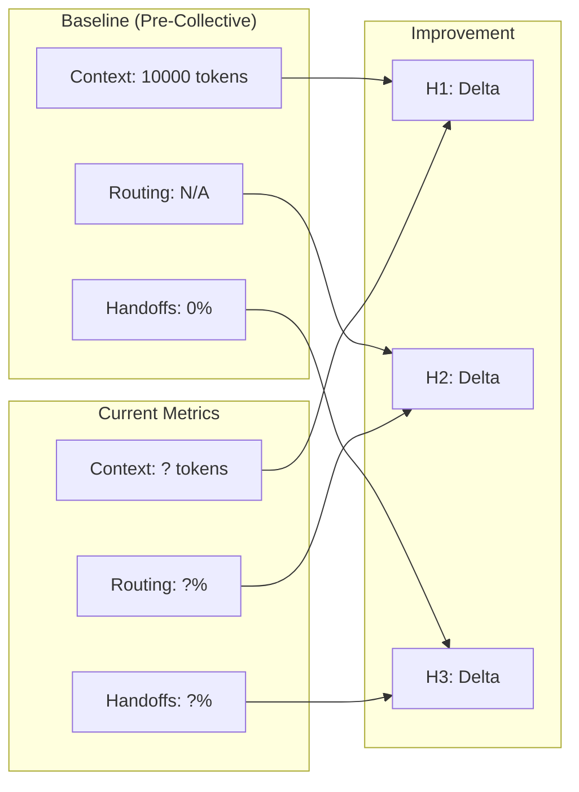

## Statistical Analysis

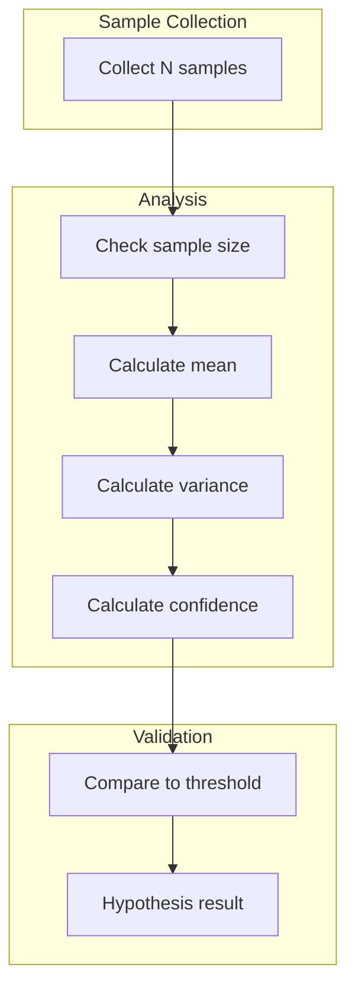

### Confidence Levels

| Sample Size | Confidence Level |
|-------------|------------------|
| < 30 | 0.50 (Insufficient) |
| 30-99 | 0.70 (Moderate) |
| 100-499 | 0.85 (Good) |
| 500-999 | 0.90 (Very Good) |
| 1000+ | 0.95 (Excellent) |

## Aggregation

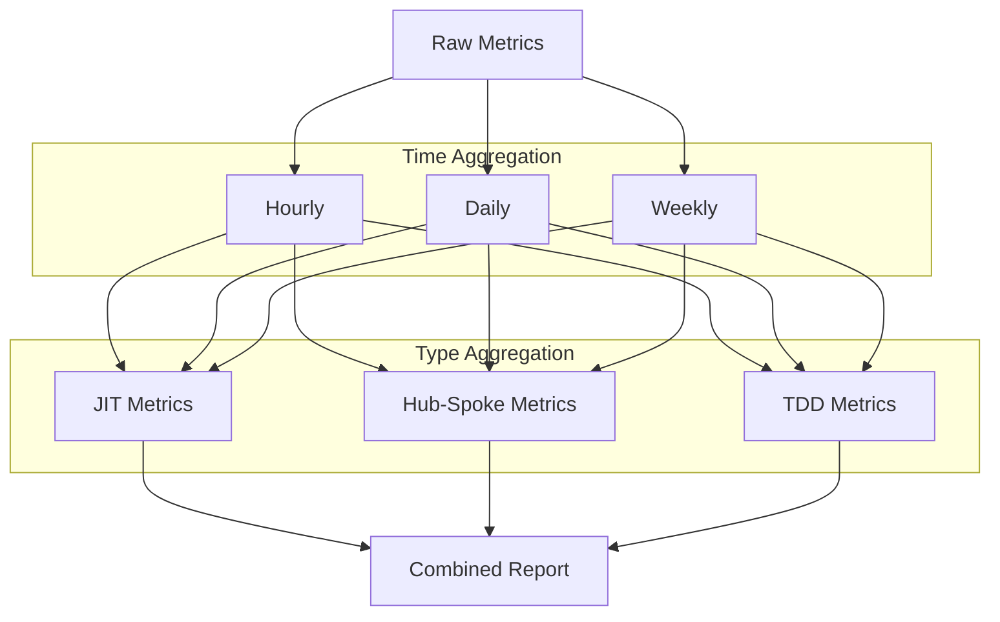

## Export Formats

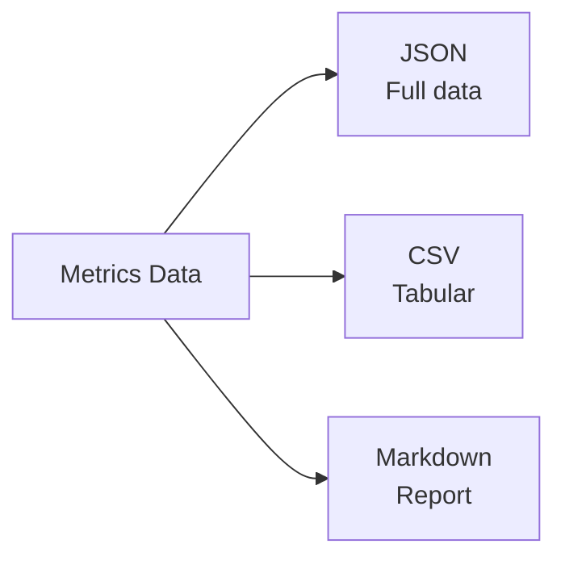

### JSON Export Structure

```json
{
  "timestamp": "ISO-8601",
  "sessionId": "string",
  "hypotheses": {
    "h1_jitLoading": {
      "validated": false,
      "confidence": 0.85,
      "metrics": {...}
    },
    "h2_hubSpoke": {
      "validated": true,
      "confidence": 0.92,
      "metrics": {...}
    },
    "h3_tddHandoffs": {
      "validated": true,
      "confidence": 0.88,
      "metrics": {...}
    }
  }
}
```

## Lifecycle Management

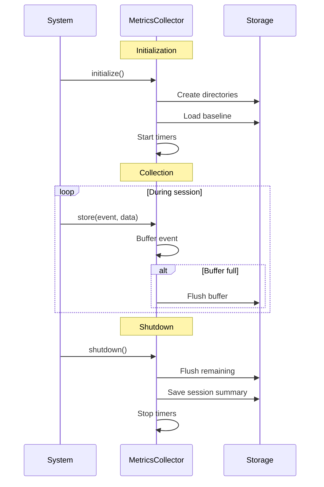

## Data Cleanup

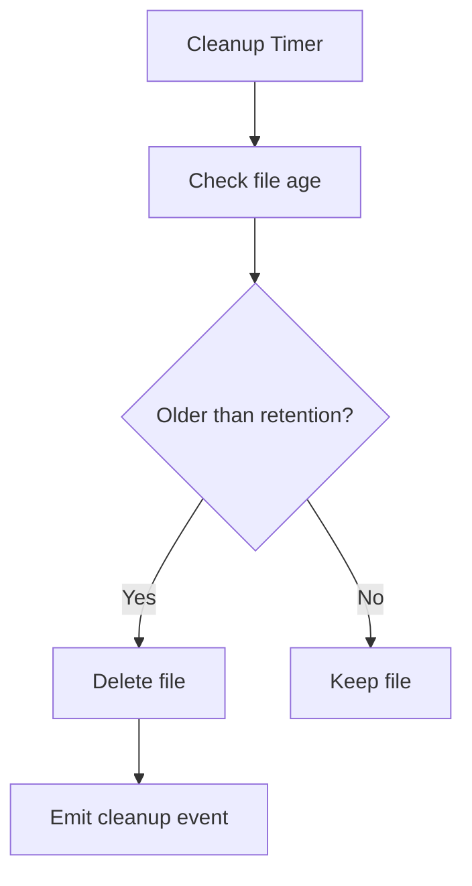

### Retention Policy

| Data Type | Default Retention |
|-----------|-------------------|
| Snapshots | 30 days |
| Aggregations | 90 days |
| Reports | 365 days |
| Sessions | 30 days |

## Real-Time Monitoring

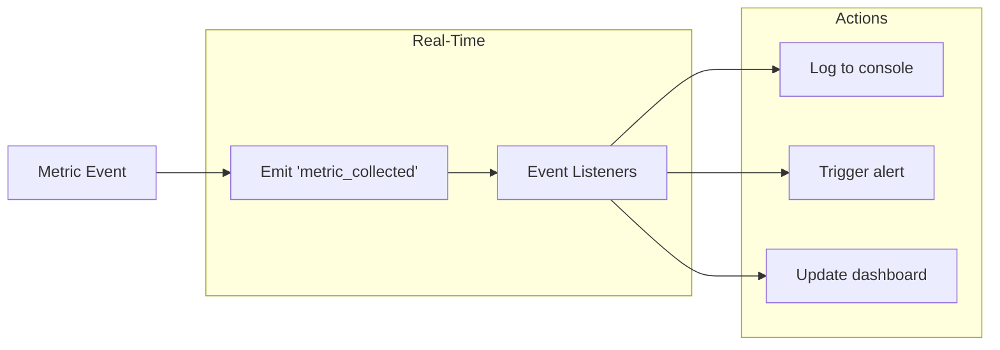

## Configuration

```json
{
  "hypotheses": {
    "h1_jitLoading": {
      "name": "JIT Context Loading",
      "targetReduction": 0.3,
      "confidenceThreshold": 0.95
    },
    "h2_hubSpoke": {
      "name": "Hub-and-Spoke Coordination",
      "targetCompliance": 0.9,
      "confidenceThreshold": 0.95
    },
    "h3_tddHandoffs": {
      "name": "Test-Driven Development Handoffs",
      "targetSuccessRate": 0.8,
      "confidenceThreshold": 0.95
    }
  },
  "collection": {
    "bufferSize": 100,
    "flushInterval": 30000,
    "enableValidation": true
  },
  "analysis": {
    "minSampleSize": 30,
    "confidenceLevel": 0.95
  }
}
```

## See Also

- [OVERVIEW.md](./OVERVIEW.md) - System architecture overview
- [HOOKS.md](./HOOKS.md) - Metrics collection hooks
- [AGENTS.md](./AGENTS.md) - Agent performance tracking
