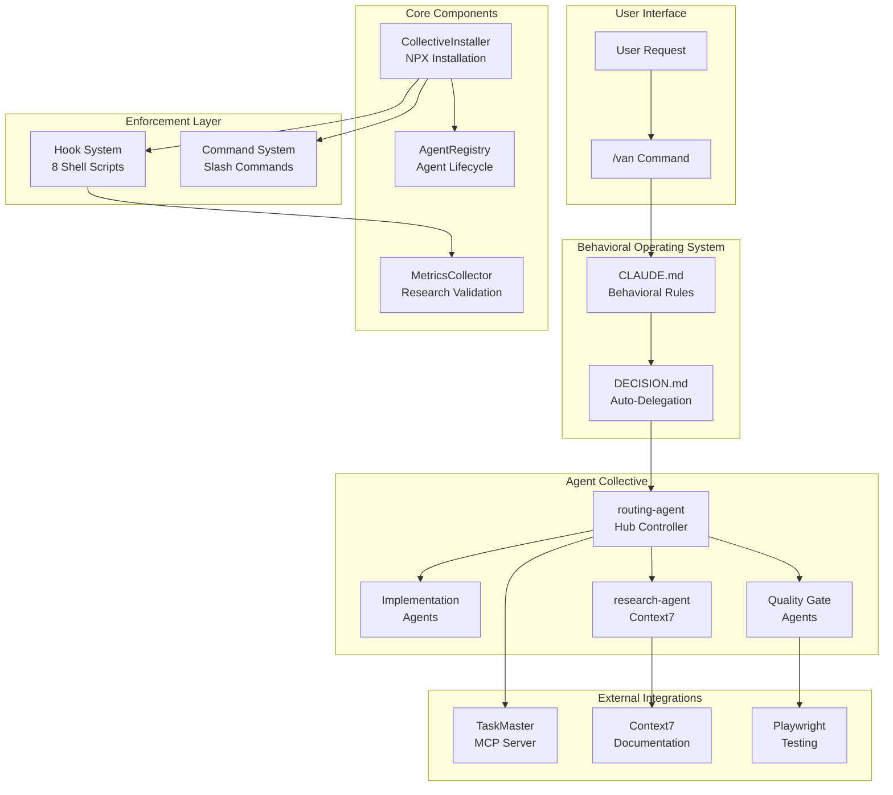
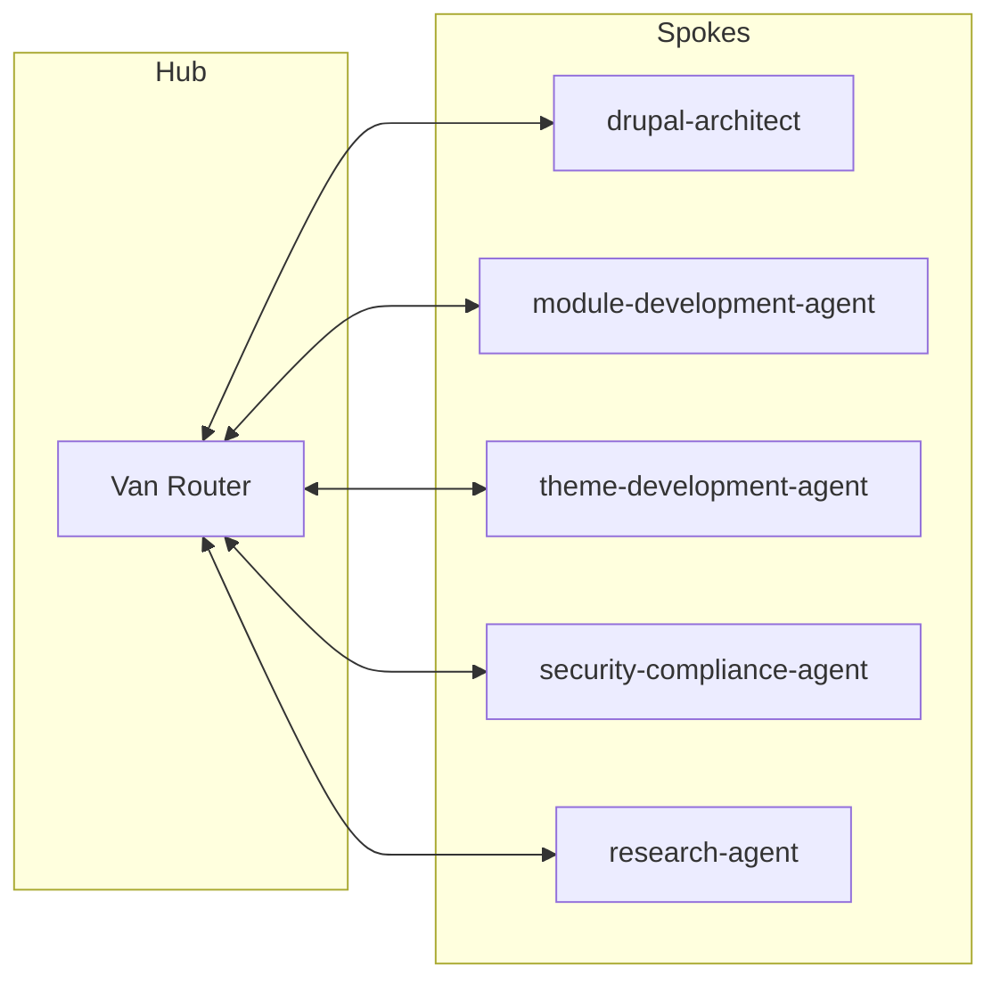
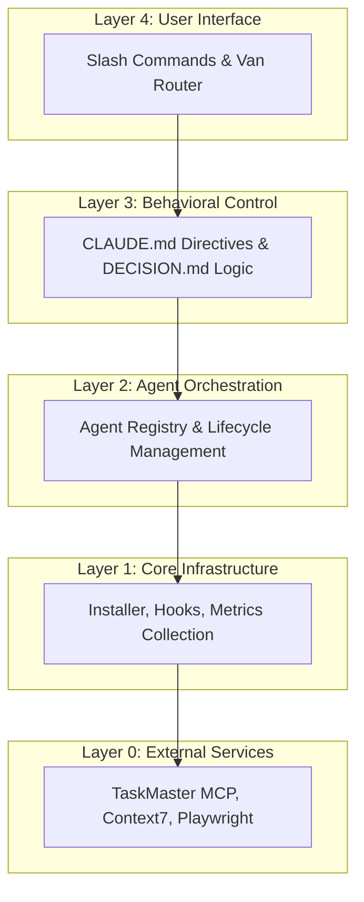
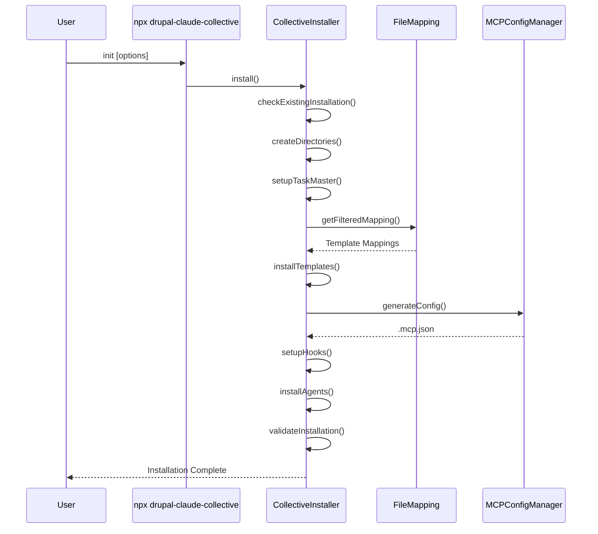
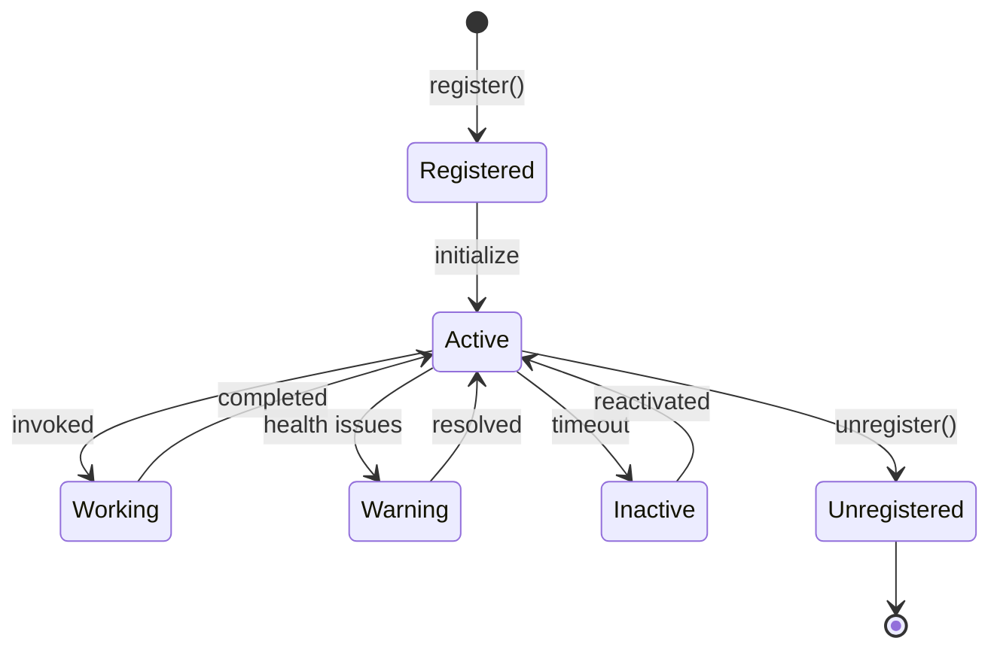
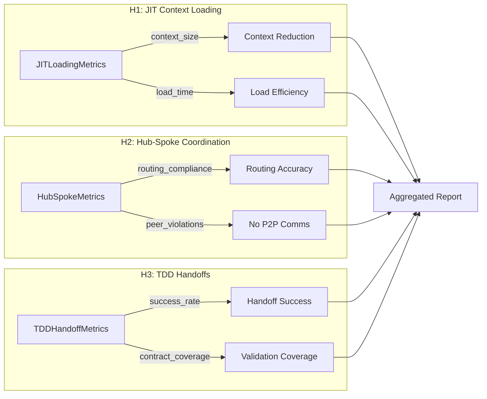
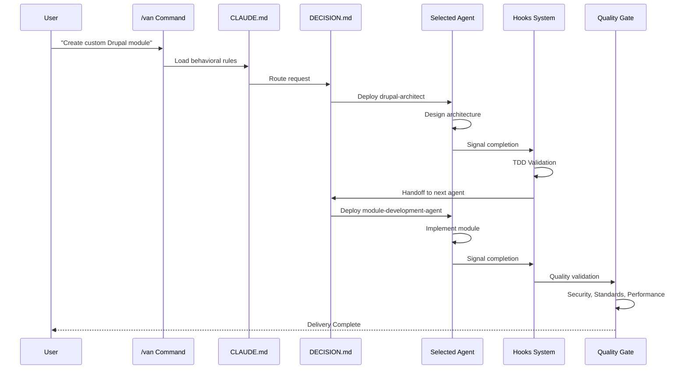
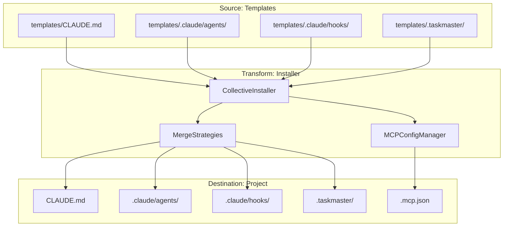
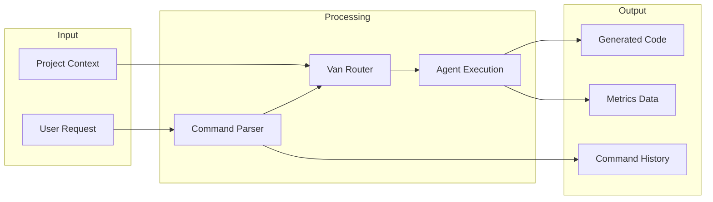
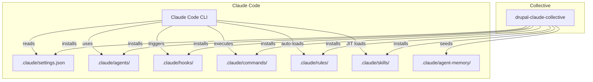

# Drupal Claude Code Sub-Agent Collective - Architecture Overview

This document provides a high-level overview of the Drupal Claude Code Sub-Agent Collective architecture, its components, and how they interconnect.

## System Purpose

The Drupal Claude Code Sub-Agent Collective is an NPX-installable framework that transforms Claude Code into a coordinated multi-agent development system specialized for Drupal 10/11 projects. It enforces:

- **Hub-and-Spoke Coordination**: Central routing through the Van command
- **Test-Driven Development**: Validated handoffs between agents
- **Drupal Best Practices**: Coding standards, security, and performance validation
- **Research Integration**: Context7 and TaskMaster for informed development

## High-Level Architecture



## Core Architectural Principles

### 1. Hub-and-Spoke Pattern

All agent communication flows through the central hub (Van routing command). Agents do not communicate peer-to-peer.



### 2. Layered Architecture



## Directory Structure

```
drupal-claude-code-sub-agent-collective/
├── bin/                           # CLI Entry Points
│   └── claude-code-collective.js  # NPX Command Handler
│
├── lib/                           # Core Library
│   ├── index.js                   # Main Entry Point
│   ├── installer.js               # CollectiveInstaller Class
│   ├── validator.js               # Installation Validator
│   ├── AgentRegistry.js           # Agent Lifecycle Manager
│   ├── AgentSpawner.js            # Dynamic Agent Creation
│   ├── AgentTemplateSystem.js     # Agent Template Processing
│   ├── command-system.js          # Command Execution Engine
│   ├── command-parser.js          # Natural Language Parsing
│   ├── merge-strategies.js        # Config Conflict Resolution
│   ├── mcp-config-manager.js      # MCP Server Configuration
│   └── metrics/                   # Research Metrics
│       ├── MetricsCollector.js    # Base Collector
│       ├── JITLoadingMetrics.js   # H1: Context Loading
│       ├── HubSpokeMetrics.js     # H2: Coordination
│       └── TDDHandoffMetrics.js   # H3: Handoff Quality
│
├── templates/                     # Installation Templates
│   ├── CLAUDE.md                  # Behavioral OS Template (~96 lines)
│   ├── .claude/                   # Claude Configuration
│   │   ├── agents/                # Agent Definitions (15, with memory + skills)
│   │   ├── hooks/                 # Enforcement Scripts (8 + shared lib)
│   │   ├── rules/                 # Auto-loaded behavioral rules (6 files)
│   │   ├── agent-memory/          # Persistent agent knowledge (5 agents)
│   │   ├── commands/              # Slash Commands
│   │   └── skills/                # Drupal skills (10 total)
│   ├── .claude-collective/        # Collective Framework
│   │   ├── tests/                 # Test Contracts
│   │   └── metrics/               # Metrics Storage
│   └── .taskmaster/               # TaskMaster Config
│
├── scripts/                       # Testing & Utilities
└── package.json                   # NPM Package Definition
```

## Key Components

### 1. Installation System

The `CollectiveInstaller` handles project setup:



### 2. Agent Registry

The `AgentRegistry` manages agent lifecycle:



### 3. Metrics Collection

Research validation through three hypothesis collectors:



## Request Flow

A typical development request flows through the system:



## Data Flow

### Configuration Data



### Runtime Data



## Integration Points

### External Services

| Service | Purpose | Connection |
|---------|---------|------------|
| **TaskMaster** | Task coordination | MCP Server via .mcp.json |
| **Context7** | Drupal documentation | MCP Server via .mcp.json |
| **Playwright** | Browser testing | MCP Server (optional) |

### Claude Code Integration



## See Also

- [AGENTS.md](./AGENTS.md) - Detailed agent system documentation
- [HOOKS.md](./HOOKS.md) - Hook system and enforcement layer
- [INSTALLATION.md](./INSTALLATION.md) - Installation process and data flow
- [COMMAND-SYSTEM.md](./COMMAND-SYSTEM.md) - Command parsing and execution
- [METRICS.md](./METRICS.md) - Research metrics and hypothesis validation
