# Drupal Agent Interaction and Workflow Diagram

## Overview
This document maps the complete Drupal agent ecosystem using a **hub-and-spoke delegation model**. Individual specialized agents complete their Drupal development work and return to the routing-agent (hub) for next decisions, preventing boundary violations. Only coordination agents (enhanced-project-manager-agent, workflow-agent) manage sequential workflows.

## Architectural Model: Hub-and-Spoke vs Pipeline

**❌ WRONG: Pipeline Model (Causes Boundary Violations)**
```
agent1 → agent2 → agent3 → agent4  // Individual agents try to coordinate others
```

**✅ CORRECT: Hub-and-Spoke Model (Prevents Boundary Violations)**  
```
routing-agent → agent1 → COMPLETE → routing-agent → next decision
routing-agent → agent2 → COMPLETE → routing-agent → next decision
```

**Key Principle**: Individual implementation agents complete their work and return to their delegator (routing-agent). Only coordination agents manage multi-agent workflows.

## Agent Interaction Tree

```mermaid
graph TD
    %% ENTRY POINTS
    USER["👤 USER REQUEST"] --> ROUTING["🔄 routing-agent<br/>Universal Request Router"]
    
    %% MAIN ROUTING DECISIONS
    ROUTING --> PRD_RESEARCH["📋 prd-research-agent<br/>PRD Analysis & Task Generation"]
    ROUTING --> ENHANCED_PM["📊 enhanced-project-manager-agent<br/>Coordinated Development Workflow"]
    ROUTING --> WORKFLOW["🔄 workflow-agent<br/>Multi-Agent Orchestration"]
    ROUTING --> RESEARCH["🔍 research-agent<br/>Technical Research & Architecture"]
    
    %% PRD CREATION BRANCH
    PRD_RESEARCH --> PRD_AGENT["📄 prd-agent<br/>Enterprise PRD Creation"]
    PRD_RESEARCH --> PRD_MVP["🚀 prd-mvp<br/>MVP/Prototype PRD Creation"]
    PRD_RESEARCH -->|"COMPLETE"| ROUTING
    PRD_AGENT -->|"COMPLETE"| ROUTING
    PRD_MVP -->|"COMPLETE"| ROUTING
    
    %% CORE DRUPAL IMPLEMENTATION WORKFLOW
    ENHANCED_PM --> ARCHITECT["🏗️ drupal-architect<br/>Site Architecture, Content Modeling"]
    ENHANCED_PM --> MODULE["💾 module-development-agent<br/>Custom Modules, Plugins, Services"]
    ENHANCED_PM --> THEME["🎨 theme-development-agent<br/>Twig Templates, SCSS, Behaviors"]
    ENHANCED_PM --> TESTING_IMPL["🧪 unit-testing-agent<br/>PHPUnit Test Suites"]
    ENHANCED_PM --> FUNCTIONAL_TESTING["🧪 functional-testing-agent<br/>Behat/Playwright Browser Testing"]
    ENHANCED_PM --> SECURITY["🛡️ security-compliance-agent<br/>Security & Coding Standards"]
    ENHANCED_PM --> DEVOPS["🚀 performance-devops-agent<br/>Performance, Deployment, CI/CD"]
    
    %% HUB-AND-SPOKE RETURN FLOWS (Individual Agents Return to Delegator)
    ARCHITECT -->|"COMPLETE"| ROUTING
    MODULE -->|"COMPLETE"| ROUTING
    THEME -->|"COMPLETE"| ROUTING
    TESTING_IMPL -->|"COMPLETE"| ROUTING
    FUNCTIONAL_TESTING -->|"COMPLETE"| ROUTING
    SECURITY -->|"COMPLETE"| ROUTING
    DEVOPS -->|"COMPLETE"| ROUTING
    
    %% COORDINATION WORKFLOWS (Only for Coordination Agents)
    ENHANCED_PM -->|"COORDINATE"| ARCHITECT
    ENHANCED_PM -->|"COORDINATE"| MODULE
    ENHANCED_PM -->|"COORDINATE"| THEME
    WORKFLOW -->|"ORCHESTRATE"| ARCHITECT
    WORKFLOW -->|"ORCHESTRATE"| MODULE
    WORKFLOW -->|"ORCHESTRATE"| THEME
    
    %% QUALITY VALIDATION FLOWS (Through Routing Hub)
    ROUTING -->|"QUALITY CHECK"| ENHANCED_QUALITY["🛡️ enhanced-quality-gate<br/>Quality Validation with Gate Enforcement"]
    ENHANCED_QUALITY -->|"QUALITY REVIEW"| QUALITY["🔍 quality-agent<br/>Code Quality, Security, Performance"]
    QUALITY -->|"VALIDATED"| COMPLETION["✅ completion-gate<br/>Task Completion Validation"]
    COMPLETION -->|"COMPLETE"| ROUTING
    
    %% READINESS AND WORKFLOW CONTROL (Coordination Agent Workflow)
    ENHANCED_PM --> READINESS["📋 readiness-gate<br/>Project Phase Advancement"]
    READINESS -->|"READY"| ENHANCED_PM
    
    %% WORKFLOW ORCHESTRATION (Coordination Agent)
    WORKFLOW -->|"ORCHESTRATE"| ARCHITECT
    WORKFLOW -->|"ORCHESTRATE"| MODULE
    WORKFLOW -->|"ORCHESTRATE"| THEME
    WORKFLOW -->|"ORCHESTRATE"| TESTING_IMPL
    WORKFLOW -->|"ORCHESTRATE"| FUNCTIONAL_TESTING
    WORKFLOW -->|"ORCHESTRATE"| SECURITY
    
    %% RESEARCH AGENT DIRECT DELEGATION (Returns to Routing)
    RESEARCH -->|"COMPLETE"| ROUTING
    
    %% STYLING AND CLASSES
    classDef entry fill:#e1f5fe,stroke:#01579b,stroke-width:3px
    classDef routing fill:#f3e5f5,stroke:#4a148c,stroke-width:2px
    classDef management fill:#fff3e0,stroke:#e65100,stroke-width:2px
    classDef implementation fill:#e8f5e8,stroke:#1b5e20,stroke-width:2px
    classDef quality fill:#ffebee,stroke:#b71c1c,stroke-width:2px
    classDef prd fill:#f1f8e9,stroke:#33691e,stroke-width:2px
    classDef research fill:#fce4ec,stroke:#880e4f,stroke-width:2px
    
    class USER entry
    class ROUTING routing
    class ENHANCED_PM,WORKFLOW,READINESS management
    class ARCHITECT,MODULE,THEME,TESTING_IMPL,FUNCTIONAL_TESTING,SECURITY,DEVOPS implementation
    class ENHANCED_QUALITY,QUALITY,COMPLETION quality
    class PRD_RESEARCH,PRD_AGENT,PRD_MVP prd
    class RESEARCH research
```



## Agent Categories and Responsibilities

### 🔄 **Entry and Routing Agents**
- **routing-agent**: Universal entry point with **complexity assessment**, analyzes Drupal requests and routes to appropriate specialized agents. Features lightweight pattern recognition for simple tasks (field creation, block placement, view configuration) that bypass heavy coordination workflows.
- **workflow-agent**: Multi-agent orchestrator with feedback loops for complex Drupal projects

### 📊 **Management and Coordination Agents**
- **enhanced-project-manager-agent**: Coordinates development phases with mandatory gate enforcement
- **readiness-gate**: Validates if project phases can advance based on completeness

### 🏗️ **Core Drupal Implementation Agents**
- **drupal-architect**: Designs site architecture, content models, module selection, database schema planning
- **module-development-agent**: Implements custom Drupal modules with hooks, plugins, services, dependency injection
- **theme-development-agent**: Creates custom themes with Twig templates, SCSS/CSS, JavaScript behaviors
- **unit-testing-agent**: Creates PHPUnit unit tests and kernel tests for custom code
- **functional-testing-agent**: Performs real browser testing with Behat/Playwright, validates Drupal user workflows
- **security-compliance-agent**: Drupal coding standards validation (phpcs), security review, access control checks
- **performance-devops-agent**: Performance optimization, caching strategies, deployment workflows, CI/CD

### 🛡️ **Drupal Quality and Validation Agents**
- **drupal-standards-gate**: Drupal coding standards validation (Drupal, DrupalPractice)
- **security-gate**: Security vulnerability checking (SQL injection, XSS, CSRF, access control)
- **performance-gate**: Query efficiency, caching validation, N+1 query detection
- **accessibility-gate**: WCAG 2.1 AA compliance validation
- **completion-gate**: Validates if Drupal tasks meet acceptance criteria

### 📋 **PRD and Research Agents**
- **prd-research-agent**: Analyzes PRDs, conducts research, performs complexity analysis, generates tasks
- **prd-agent**: Creates comprehensive, enterprise-grade Product Requirements Documents
- **prd-mvp**: Creates lean MVP PRDs focused on rapid prototyping
- **research-agent**: Conducts technical research, architecture analysis, technology evaluation

## Handoff Token System

Each agent uses standardized handoff tokens to ensure proper workflow coordination:

### Hub-and-Spoke Return Tokens (Individual Agents Return to Delegator)
- `ARCH_COMPLETE_A5K7` - Architecture design complete, return to routing-agent
- `MODULE_COMPLETE_M7K5` - Module implementation complete, return to routing-agent
- `THEME_COMPLETE_T8K6` - Theme implementation complete, return to routing-agent
- `TEST_COMPLETE_T9K7` - Testing implementation complete, return to routing-agent
- `FUNCTIONAL_COMPLETE_F9K7` - Functional testing complete, return to routing-agent
- `SECURITY_COMPLETE_S5K8` - Security validation complete, return to routing-agent
- `DEVOPS_COMPLETE_D7K9` - DevOps/Performance implementation complete, return to routing-agent

### Coordination Workflow Tokens (Coordination Agents Only)
- `COORD_ARCH_C4M7` - Enhanced project manager coordinates architecture
- `COORD_MODULE_C6L8` - Enhanced project manager coordinates module development
- `COORD_THEME_C8M2` - Enhanced project manager coordinates theme development
- `ORCHESTRATE_PARALLEL_O5N4` - Workflow agent orchestrates parallel work
- `ORCHESTRATE_SEQUENCE_O7P6` - Workflow agent orchestrates sequential work

### Quality and Completion Tokens
- `QUALITY_REQUIRED_Q3R5` - Route to quality validation via routing-agent
- `QUALITY_PASSED_Q5M7` - Quality validation complete, return to routing-agent
- `TASK_COMPLETE_T3R9` - Task completion validated
- `COORD_REQUIRED_C7M1` - Project coordination needed

### Complexity Assessment Tokens
- `SIMPLE_DRUPAL_N7Q3` - Simple Drupal task, direct to module-development-agent
- `SIMPLE_COMPOUND_E4T7` - Simple compound request, bypass coordination overhead
- `COMPLEX_COMPOUND_E9M5` - Complex multi-component request, requires coordination

## Workflow Patterns

### 1. **Hub-and-Spoke Direct Delegation**
```
routing-agent → drupal-architect → COMPLETE → routing-agent → next decision
routing-agent → module-development-agent → COMPLETE → routing-agent → next decision
routing-agent → theme-development-agent → COMPLETE → routing-agent → next decision
routing-agent → functional-testing-agent → COMPLETE → routing-agent → next decision
```

### 2. **Coordinated Drupal Development Flow (via Enhanced Project Manager)**
```
routing-agent → enhanced-project-manager-agent → coordinates: drupal-architect → module-development-agent → theme-development-agent → functional-testing-agent
→ security-compliance-agent → performance-gate → completion-gate → enhanced-project-manager-agent
```

### 3. **Research-Driven Flow**
```
routing-agent → research-agent → COMPLETE → routing-agent → prd-research-agent → COMPLETE → routing-agent
→ enhanced-project-manager-agent → [coordinated implementation] → completion
```

### 4. **Complex Multi-Agent Orchestration (via Workflow Agent)**
```
routing-agent → workflow-agent → orchestrates: [parallel: drupal-architect + research] → COMPLETE → workflow-agent
→ orchestrates: [coordinated: module-development-agent + theme-development-agent] → COMPLETE → workflow-agent → completion
```

### 5. **Quality Validation Flow**
```
routing-agent → enhanced-quality-gate → quality-agent → completion-gate → COMPLETE → routing-agent
```

### 6. **Complexity Assessment Flow**
```
routing-agent → [complexity pattern analysis] → SIMPLE PATTERN → module-development-agent → COMPLETE → routing-agent
routing-agent → [complexity pattern analysis] → COMPLEX PATTERN → enhanced-project-manager-agent → [coordination]
```

**Examples:**
- "Create custom block plugin showing recent articles" → SIMPLE → module-development-agent
- "Build event management system with registration" → COMPLEX → enhanced-project-manager-agent

## Gate Enforcement Points

### Mandatory Drupal Quality Gates
1. **Drupal Coding Standards**: All code must pass phpcs with Drupal and DrupalPractice standards
2. **Security Validation**: No SQL injection, XSS, or access control vulnerabilities
3. **Performance Check**: Efficient queries, proper caching, no N+1 query patterns
4. **Accessibility Standards**: WCAG 2.1 AA compliance for all UI components
5. **Configuration Export**: All configuration changes must be exportable
6. **Functional Testing**: User workflows validated with Behat or Playwright

### Agent Structure Requirements
**MANDATORY AGENT STRUCTURE**: All agents must follow EXACT format:
1. **YAML Frontmatter**: name, description, tools, color
2. **CRITICAL EXECUTION RULE**: Mandatory execution rule with Mermaid path following
3. **Mermaid Decision Diagram**: Complete workflow with decision nodes using SIMPLE format
4. **NOTHING ELSE**: No additional documentation or content in agent files

**CRITICAL FIX APPLIED**: component-implementation-agent was missing CRITICAL EXECUTION RULE and Mermaid diagram, causing inappropriate auto-testing behavior (running web servers, npm run dev for simple file modifications). Fixed with proper workflow that enforces:
- NO web servers or testing commands unless explicitly requested
- Focus ONLY on file modifications (HTML, CSS, JS, React components)
- Return to delegator when implementation complete

**CRITICAL FIX APPLIED**: infrastructure-implementation-agent was missing CRITICAL EXECUTION RULE and Mermaid diagram, causing catastrophic routing instruction violations. Fixed with proper workflow that enforces:
- MANDATORY Context7 research for build tools and framework setup
- MANDATORY build system validation with npm run build
- Research-backed tooling configurations - no training data assumptions
- TypeScript strict configuration and validation required
- Development environment must work in WSL2 with file watching
- Return to delegator when infrastructure setup complete - no feature implementation

**REMAINING STRUCTURE ISSUES**: feature-implementation-agent, testing-implementation-agent, and polish-implementation-agent are missing CRITICAL EXECUTION RULE and may exhibit similar inappropriate behaviors.

### Gate Validation Sequence
```
Implementation → Build Validation → Quality Gate → Completion Gate → Next Phase/Handoff
```

## Agent Communication Protocol

### Hub-and-Spoke Response Format
```
PHASE: [Phase] - [Status with details]
STATUS: [System] - [Implementation status with validation]
**ROUTE TO: @routing-agent - [Work complete, ready for next decision]** OR **TASK COMPLETE**
DELIVERED: [Specific deliverables implemented]
VALIDATION/INTEGRATION: [Status and interface details]
HANDOFF_TOKEN: [TYPE]_COMPLETE_[ID]
```

### Coordination Agent Response Format (Enhanced Project Manager / Workflow Agent)
```
PHASE: [Phase] - [Coordination status with details]
STATUS: [System] - [Coordination status with validation]
**ROUTE TO: @specific-agent - [Coordination directive with context]** OR **COORDINATION COMPLETE**
DELIVERED: [Coordination actions and agent assignments]
VALIDATION/INTEGRATION: [Cross-agent coordination status]
HANDOFF_TOKEN: [COORD/ORCHESTRATE]_[ACTION]_[ID]
```

### Handoff Requirements
- Individual agents MUST return to their delegator (routing-agent)
- Only coordination agents may delegate to other agents
- Handoff tokens distinguish between COMPLETE (return) vs COORDINATE (delegate)
- Integration interfaces must be documented for routing decisions

## Error Handling and Escalation

### Loop Prevention
- Maximum 3 retry attempts per validation cycle
- Automatic escalation to project coordination after retry limit
- Progress validation to prevent circular patterns

### Escalation Patterns
```
Individual Agent Blocked → COMPLETE with error context → routing-agent → enhanced-project-manager-agent → workflow-agent
```

### Error Recovery
- Failed builds trigger configuration analysis and fixes
- Quality failures require comprehensive validation retry
- Integration conflicts escalate to project coordination

## Agent Tool Access Control

### Global Tool Restriction Implementation

**COMPLETED**: Global agent tool restriction to prevent inappropriate command execution.

#### Tool Access Matrix

**File Modification Only (No Bash Access):**
- ✅ `theme-development-agent` - Only needs Read, Write, Edit, MultiEdit for Twig templates and SCSS
- ✅ `content-migration-agent` - Only needs Read, Write, Edit, MultiEdit for migration files

**Command Execution Required (Bash Access Maintained):**
- ✅ `module-development-agent` - Needs Bash for Drush commands (drush cr, drush cex, drush updb)
- ✅ `unit-testing-agent` - Needs Bash for test execution (./vendor/bin/phpunit)
- ✅ `security-compliance-agent` - Needs Bash for phpcs, phpstan, security validation
- ✅ `performance-devops-agent` - Needs Bash for deployment, CI/CD, performance profiling
- ✅ `functional-testing-agent` - Needs Bash for Behat/Playwright testing and server startup

#### Prevention of Inappropriate Commands

**RESOLVED ISSUE**: Some agents were inappropriately running development servers or test commands when only file modifications were needed.

**SOLUTION**: Removed Bash access from pure implementation agents that only need file modifications (theme templates, migration configs).

#### Tool Access Rules

1. **File-only agents**: `tools: Read, Write, Edit, MultiEdit, Glob, Grep, mcp__task-master__get_task, LS`
2. **Command-execution agents**: Include `Bash` for Drush, Composer, phpcs, phpunit, deployment
3. **Specialized agents**: Include specific tools (Playwright for browser testing, etc.) as needed

---

*This diagram represents the current agent ecosystem as of the latest agent architecture updates. Agents in the archive/ folder are not included in active workflows.*